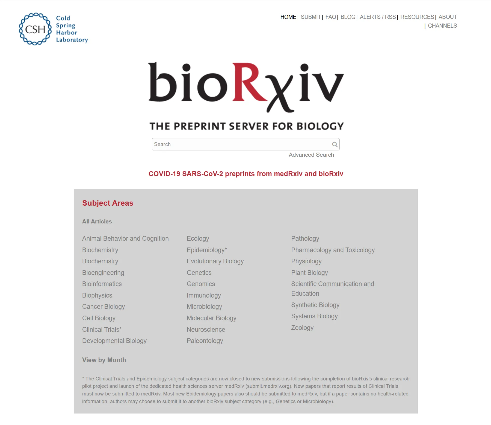
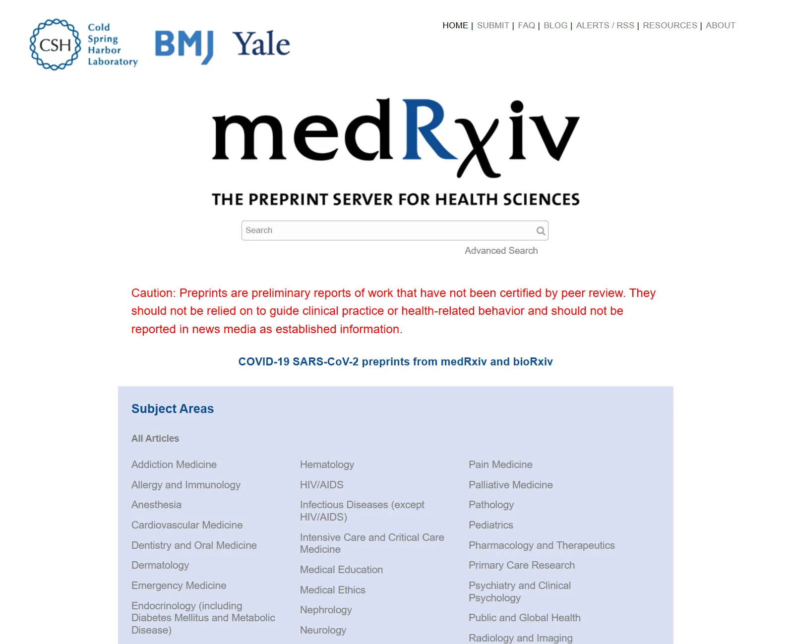

## 🧬 什么是预印本（Preprint）？

预印本是指在**同行评审前**公开发布的学术研究手稿。它允许研究人员在等待期刊评审与正式出版期间，**提前将研究成果传播给全球学术界**，加速科学交流，提升成果影响力。

---

## 🌐 bioRxiv 与 medRxiv 简介

| 平台 | 领域 | 主办机构 |
| --- | --- | --- |
| **bioRxiv** | 生命科学（biology） | Cold Spring Harbor Laboratory（CSHL） |
| **medRxiv** | 医学与健康科学（medicine） | Yale Univ.、BMJ、CSHL 联合主办 |
- 两者共享技术平台，但**审核机制**略有差异，medRxiv 审核更严格，尤其关注伦理与潜在公众误解。
- 投稿可获得 **DOI 编号**，被 Google Scholar、Europe PMC 等收录，可被引用。

---

## ✍️ 投稿流程（以 bioRxiv 为例）

1. 上传文稿（PDF/DOCX）及补充信息（摘要、关键词、作者等）
2. 平台初审（非学术评审，主要看伦理、声明等）
3. 通过后会在 **24–72 小时内上线**
4. 可发布多版本（V1, V2, …），每版有时间戳记录
5. 自动生成 DOI，例如：`10.1101/2025.05.04.123456`

---

## 📄 授权协议与版权

- 默认推荐使用 **CC-BY 4.0**，支持他人转载与使用，需署名
- 也可选 **CC-BY-NC-ND**（禁止商业和改作）
- 作者**保留版权**，不影响后续期刊投稿

---

## 📚 引用方式

```
Zhou, E. (2025). Title of Preprint. bioRxiv. https://doi.org/10.1101/2025.05.04.123456

```

建议在引用中注明为 “preprint”，以区分正式出版物。

---

## 🔁 与正式期刊的关系

- 大部分期刊（如 Nature, Cell, eLife）支持在 preprint 后投稿
- 个别期刊（如 NEJM）仍有一定限制
- 有些期刊允许“同行评审+预印本平台同步更新”

---

## 🧠 为什么预印本重要？

- ⏱️ **快**：几天内发布，远快于传统出版流程
- 🧪 **开放**：任何人可阅读、评论与引用
- 🔬 **抢先权**：可锁定研究优先权，保护原创性
- 👥 **合作**：更早获得反馈、拓展同行连接
- 📈 **曝光**：更易获得引用、媒体报道

---

## 🔗 延伸阅读与参考链接

- [bioRxiv 官网](https://www.biorxiv.org/)
- [medRxiv 官网](https://www.medrxiv.org/)
- [Sherpa Romeo：期刊是否接受预印本](https://v2.sherpa.ac.uk/romeo/)
- [Preprints.org](https://www.preprints.org/)
- [Open Science Principles](https://www.fosteropenscience.eu/)

---
