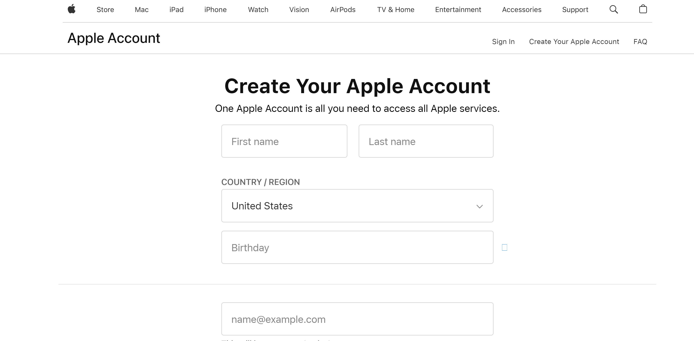
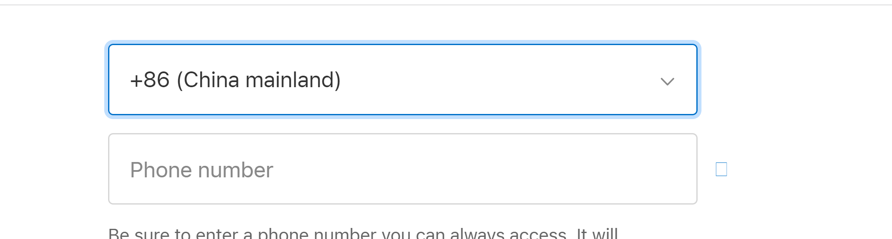

## 📖 背景说明（Background）

美区 Apple ID（即注册国家为“美国”的 Apple 账号）可以访问更多样的 App 与服务。例如：

- 下载美区独占或中国未上线的 App（如 ChatGPT、TestFlight）
- 注册 Apple Developer 账户
- 使用 iCloud Drive、Apple Music、Apple Books、News+ 等国际服务
- 避免高额 App 内购税（搭配免税州地址使用）

为了确保流程顺利、安全、合规，本文提供一套标准的注册方法。

---

## 🎯 使用场景（Use Cases）

- 下载仅限美区的 App（如 ChatGPT 原生版）
- 访问美国区 App Store、Music、TV+、News+ 等服务
- 注册 Apple 开发者账号
- 使用海外订阅服务（如 Netflix 美区、Spotify）
- 配合 VPN 使用美区网络生态

---

## 🧰 所需工具（Tools）

| 工具名称 | 用途 | 推荐链接 |
| --- | --- | --- |
| 📮 可用邮箱 | 注册 Apple ID 所需，推荐使用 Gmail | [gmail.com](https://gmail.com/) |
| 🏠 境外地址生成器 | 提供美区免税州地址 | [meiguodizhi.com](https://www.meiguodizhi.com/) |
| 📱 iOS/macOS 设备或 Safari 浏览器 | 进行首次登录激活账号 | — |
| 💳 支付方式（可选） | 若需使用付费服务，可后续绑定美区 PayPal、虚拟信用卡 | US Unlocked、Privacy.com（需科学上网） |

---

## 🪜 操作流程（Procedure）

### Step 1：准备邮箱

- 建议使用 **Gmail** 或 **Outlook**，避免使用国内邮箱

### Step 2：访问注册页面

前往 👉 https://appleid.apple.com/account

点击「**创建您的 Apple ID**」

### Step 3：填写注册信息

| 字段 | 建议填写内容 |
| --- | --- |
| 国家/地区 | United States 🇺🇸 |
| 姓名 | 英文格式（如 Tom Cruise） |
| 出生日期 | ≥18岁 |
| 邮箱 | 第一步准备好的邮箱 |
| 密码 | 至少8位，包含大小写和数字 |
| 国家区号 | +86 |
| 手机号 | 填写国内手机号 |

---

### Step 4：邮箱 & 手机验证

- 你将收到一封验证码邮件，输入后继续
- 若需绑定手机号，可用 Google Voice、TextNow 等虚拟号，或者绑定中国号码
- 先后接收邮箱验证码和手机验证码，即可完成网页端注册
    - 此时可能会因为各种原因提醒暂时无法注册，可以通过以下方式解决
        - 换个wifi
        - 换个时间
        - 换一天
        - 电话联系apple：400-666-8800

---

### Step 5：登录 App Store，首次激活账号

- 在 iPhone / Mac 上打开 App Store
- 登录刚创建的 Apple ID
- 系统提示「**此 Apple ID 尚未在 iTunes Store 使用过**」 → 点击继续
- 填写类似以下信息：

| 字段 | 示例内容（建议免税州） |
| --- | --- |
| Payment Method | None（无） |
| Street | 123 Main St |
| City | Wilmington |
| State | DE（Delaware） |
| Zip Code | 19801 |
| Phone | 302-555-1234 |

> ✅ 可参考上篇 SOP【生成境外地址】中提供的 五大免税州，推荐 Delaware、Oregon、Montana 等。
> 

---

## ✅ 使用建议（Tips）

- 🌏 搭配 VPN 使用美区订阅服务（如 Apple Music、ChatGPT等）
- 🗂 可以创建多个 Apple ID，用于不同国家区域的 App 下载
- 📦 注册完成后可长期使用，不影响原国区 Apple ID

---

## ❓ 常见问题（FAQ）

| 问题 | 解法 |
| --- | --- |
| 无法选择「None」付款方式 | 必须首次在 App Store 登录，触发地址填写界面 |
| 注册失败 / 卡在验证 | 更换网络、使用 Safari 浏览器、关闭 VPN 重试 |
| 邮箱收不到验证码 | 检查垃圾箱或更换邮箱 |
