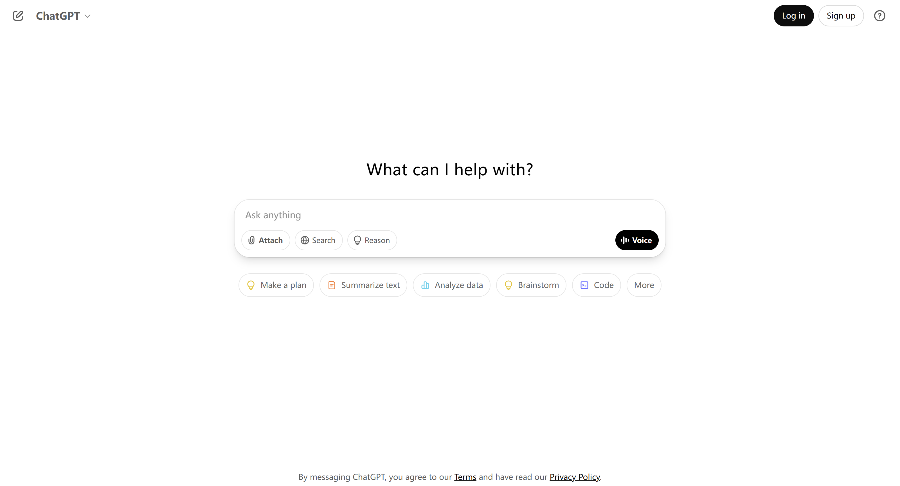

> 本文旨在帮助大陆用户顺利完成 ChatGPT 的注册与 Plus 订阅，适配网页端和 App Store 两种路径。

---

## 🧭 目录

1. 背景说明
2. 所需工具
3. 注册并登录 ChatGPT
4. 订阅 GPT Plus（两种方式）
5. 常见问题解答（FAQ）

---

## 📖 背景说明

ChatGPT 是由 OpenAI 提供的自然语言对话工具。免费用户可限制使用 GPT-4o 模型，Plus 订阅者则可使用最新的 GPT-o4。

由于地区限制，大陆用户需通过科学上网访问 ChatGPT 官网或 App。

---

## 🧰 所需工具

| 工具 | 用途 | 说明 |
| --- | --- | --- |
| Gmail 账号 | 注册 ChatGPT | 推荐使用谷歌邮箱 |
| 科学上网工具 | 访问官网/App | 建议使用机场 + 客户端 |
| 美区 Apple ID | iOS 端订阅 | 用于 App Store 路线 |
| 美区地址+虚拟信用卡 | 网页端订阅 | 用于绑定 ChatGPT Plus 支付 |

---

## 📝 注册并登录 ChatGPT

### Step 1：创建 Gmail 账号

访问 [Google 注册页面](https://accounts.google.com/signup)，填写信息完成注册。

---

### Step 2：注册 ChatGPT 账号

1. 确保 VPN 已连接
2. 打开 [https://chatgpt.com](https://chatgpt.com/)
3. 点击 Sign up，选择 **Continue with Google**
4. 登录 Gmail
5. 成功进入后，即可开始使用免费版 ChatGPT（GPT-4o）

---

## 💳 订阅 GPT Plus（两种方式）

### ✅ 方法一：iOS App Store 礼品卡订阅（推荐）

1. 注册美区 Apple ID
2. 下载 ChatGPT iOS App
3. 登录账号，点击 App 内 "Upgrade to Plus"
4. 通过闲鱼等平台购买美区 Apple 礼品卡并充值
5. 使用余额完成 $19.99/月 的订阅付款
6. 也推荐使用支付宝小程序 Pockyt Shop 购买礼品卡，根据实时汇率购买需要的金额

---

### ✅ 方法二：网页端信用卡订阅

1. 登录 ChatGPT 官网，点击左下角"Upgrade to Plus"
2. 输入美国地址（如 Shipito）
3. 使用虚拟信用卡（如 Wise）绑定支付，完成订阅

---

## ❓ 常见问题（FAQ）

| 问题 | 解答 |
| --- | --- |
| ChatGPT 官网打不开？ | 检查 VPN 是否正常连接，建议使用美英节点 |
| 礼品卡怎么买？ | 闲鱼搜索"美区 Apple 礼品卡"，注意选信誉商家，或使用支付宝 Pockyt Shop |
