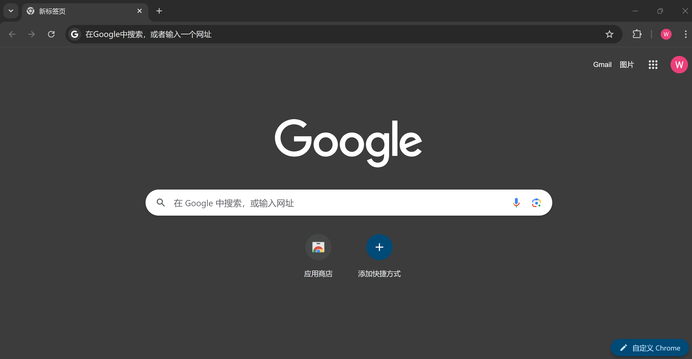
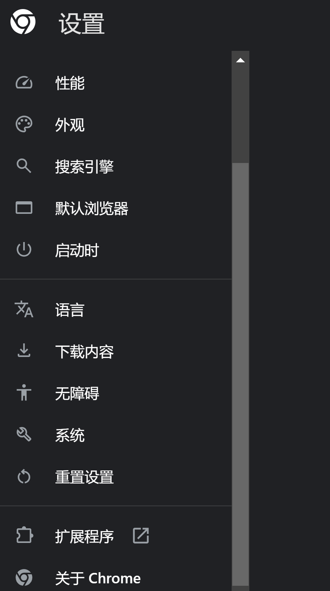
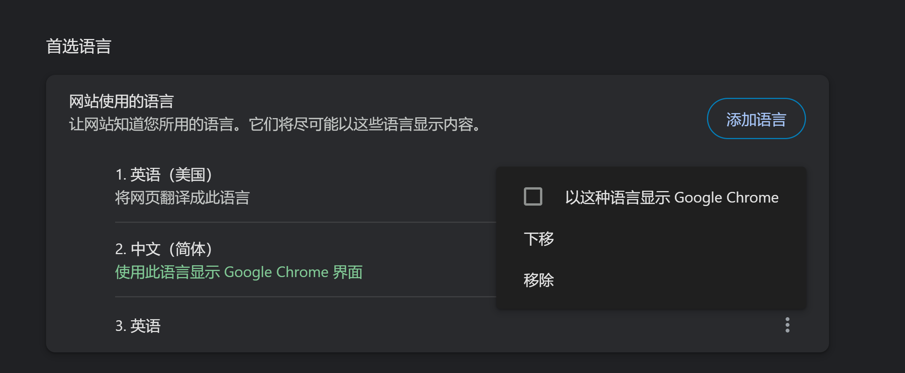
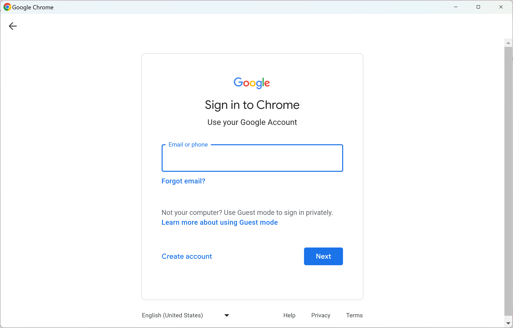

本文旨在为大陆用户提供一份详细的Google账号注册指南。对于许多人来说，Google账号不仅是访问Gmail、Google Drive、YouTube等服务的入口，也是连接全球信息和工具的重要钥匙。由于政策限制和技术壁垒，大陆用户在注册Google账号时可能会遇到一些特殊挑战。本指南将帮助您快速、顺利地完成账号创建，并解决常见问题。

---

### **为什么需要Google账号？**

1. **同步数据**：将您的浏览历史、书签和密码同步到多个设备，方便管理个人信息。
2. **访问服务**：解锁Google生态系统，包括Gmail、Google Drive、Google Calendar和YouTube等热门服务。
3. **更多可能**：Google账号还可以用来注册第三方应用程序，简化登录流程。

---

### **工具清单** 🔧

- 一个有效的手机号
- 一个常用邮箱地址（备用可选）
- Google Chrome 浏览器

---

### **创建Google账号的步骤**

---

### **1. 安装Google Chrome** 🌐

1. 使用微软Edge浏览器访问 [Google Chrome官网](https://www.google.com/intl/zh-CN/chrome/)。
2. 下载并安装Chrome，完成后打开浏览器。

---

### **2. 设置浏览器语言为英语** 🛠️

> 将语言设置为英语，可以避免部分地区的注册限制提示。

1. 点击浏览器右上角的"三点"图标，选择 **Settings（设置）**。

    

2. 在左侧导航栏中选择 **Languages（语言）**，将英语移至首位，并移除中文选项。

    

3. 重新启动浏览器以使语言设置生效。

---

### **3. 注册Google账号** 📝

1. 打开Chrome浏览器，点击右上角的头像图标，选择 **Add（添加账号）**。
2. 在登录界面选择 **Create account（创建账号）**，并选择 **For my personal use（个人用途）**。

    

3. 填写个人信息：
    - **姓名**
    - **生日与性别**
    - 自定义或选择一个邮箱地址
    - 设置符合要求的安全密码
4. 验证手机号：
    - 选择国家代码（如中国为 +86）并填写手机号。
    - 输入Google发送的验证码以完成验证。
5. （可选）填写备用邮箱地址以增强账号安全性。

---

### **附加资源** 📂

如果遇到问题，可以参考以下链接：

- [Google帮助中心](https://support.google.com/)
- [如何重置Google账号密码](https://support.google.com/accounts/answer/41078?hl=zh-Hans)
