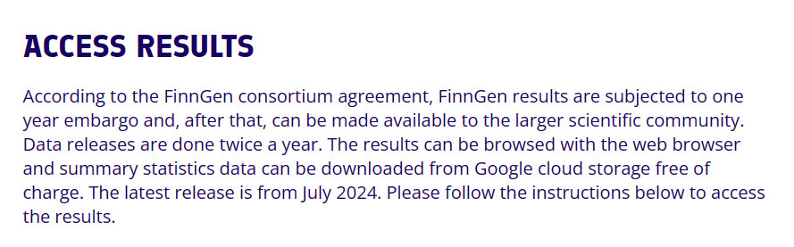
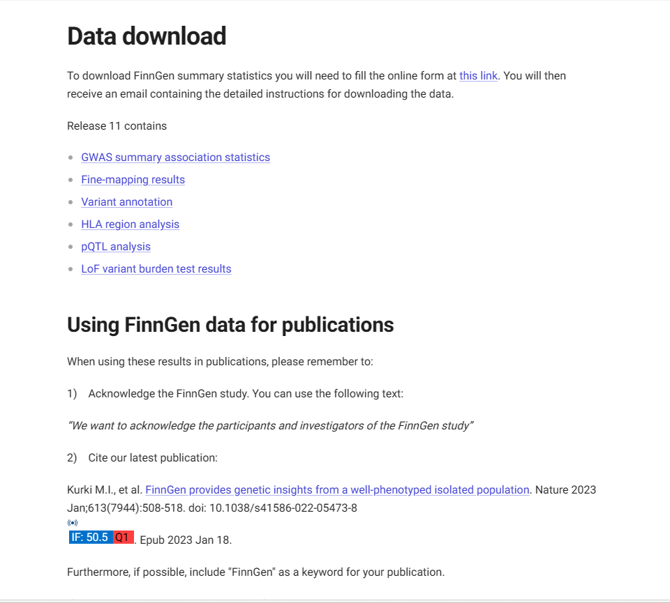
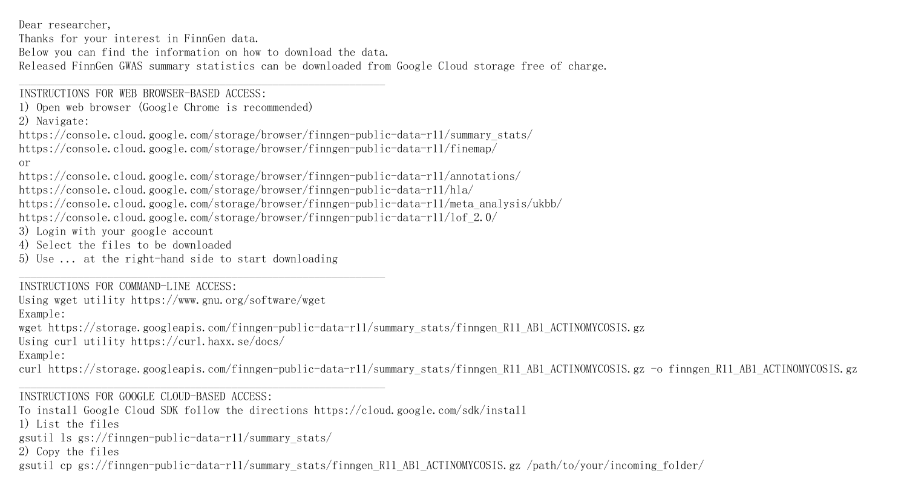

### 1. 概述 (Overview)

本文档提供访问 FinnGen 数据库公开发布的 GWAS 汇总（Summary）数据的操作指南。

这些数据是进行孟德尔随机化（MR）分析的宝贵资源，可用作暴露或结局数据源。

https://www.finngen.fi/en

### 2. 准备工作：了解数据 (Preparation: Understanding the Data)

在开始下载前，建议先了解 FinnGen 的数据政策和内容：

### 数据政策 (Data Policy)

- **保护期 (Embargo)**: FinnGen 结果享有一年的发布保护期。
- **更新周期 (Updates)**: 保护期过后，数据每年公开发布两次。
- **费用 (Cost)**: 数据可从 Google Cloud Storage 免费下载。

### 数据内容 (Data Content)

您可以在 FinnGen 的数据访问页面 查看最新的数据版本（例如 R11） 和所有可用的表型。建议在下载前先确认所需研究的表型ID。

### 3. 操作流程：获取数据 (Procedure: Getting the Data)

获取数据的完整流程如下：

**步骤 1：访问数据结果页面 (Access the Results Page)**

- 打开 FinnGen 官方的数据访问页面：
    
    https://www.finngen.fi/en/access_results
    

**步骤 2：注册获取访问权限 (Register for Access)**

- 在页面的数据下载说明中，找到并点击**this link**注册链接。
    
    
    
- 根据提示完成注册（通常需要提供邮箱和机构信息）。

**步骤 3：查收邮件并下载 (Check Email and Download)**

- 提交注册后，您的邮箱将收到一封包含访问地址的邮件。
    
    
    
- 该邮件将提供用于在线浏览或批量下载（通常来自 Google Cloud Storage）数据的链接。

### 4. R12 Manifest 共享 (R12 Manifest Sharing)

为了更高效地浏览和下载最新的 **FinnGen R12** 版本汇总统计数据，这里提供了两份关键文件的共享：

| 文件名 | 描述 |
| --- | --- |
| **`summary_stats_finngen_R12_manifest.tsv`** | R12 版本的主 manifest 文件，列出了所有表型（phenotype）的基本信息及对应 summary statistics 文件路径，可用于筛选感兴趣的研究或批量下载。 |
| **`summary_stats_finngen_R12_summary_stats_readme.txt`** | 官方提供的说明文件，解释了 manifest 文件中各字段的含义、数据格式及使用注意事项。 |

您可以通过以下 Google Drive 链接获取：

- 🔗 [R12 manifest 文件](https://drive.google.com/file/d/1skl_5a9vd1-QS4SpKuOKLCYCV3Npk9Z6/view?usp=sharing)
- 🔗 [R12 readme 文件](https://drive.google.com/file/d/1ubexBbhwv1R0iUMcfU8wpDuH1supzvAd/view?usp=sharing)

### 5. 关键链接 (Key Links)

- **FinnGen 官网**: `https://www.finngen.fi/en`
- **数据访问页面**: `https://www.finngen.fi/en/access_results`
