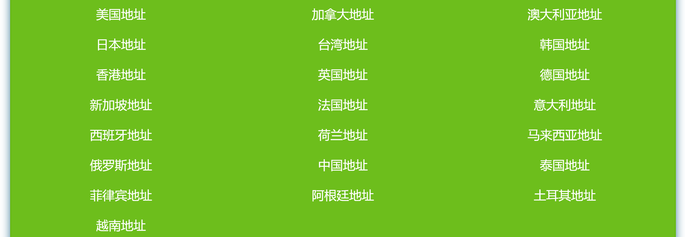
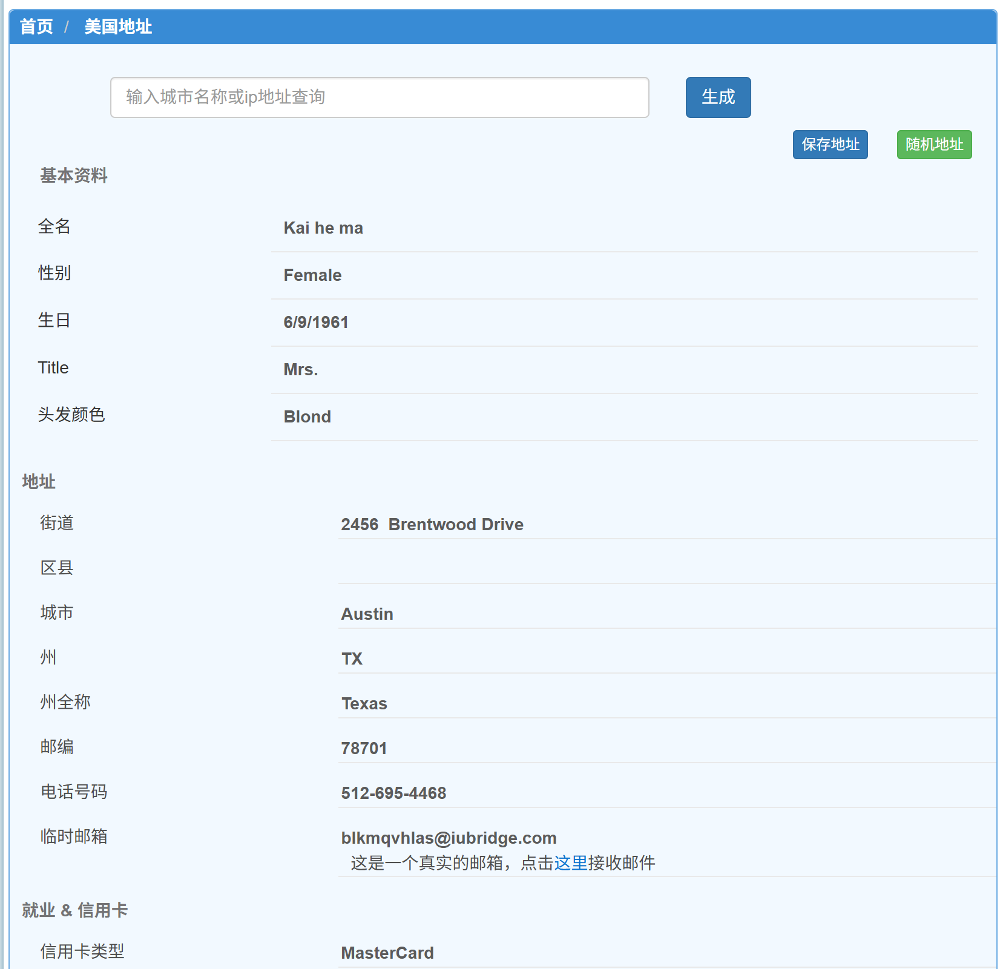

## **📖 背景说明（Background）**

在注册国际平台（如 Apple ID、GitHub、NIH、Coursera 等）或进行功能测试时，用户经常需要填写一个特定国家或地区的有效地址信息，作为身份信息的一部分。

这类地址主要用于：

- 通过地区验证（如 App Store 国家/地区设置）
- 启用特定区域服务
- 测试系统中的国际化功能

> ⚠️ 本流程仅适用于测试或注册用途，不得用于涉及法律、财务、签证等敏感事项。请务必遵守所在地法律法规，合法使用生成信息。
> 

---

## **🎯 使用场景（Use Cases）**

- 创建 **美区 Apple ID**
- 注册或登录 **国际学术平台**
- 配置 **海外软件商店账号**
- 开展软件系统中与 **地址字段相关的自动化测试**

---

## **🧰 所需工具（Tools）**

| **工具名称** | **链接** | **简要说明** |
| --- | --- | --- |
| 🏠 境外地址生成器 | [meiguodizhi.com](https://www.meiguodizhi.com/hk-address) | 中文界面，支持多个国家，操作简洁直观 |
| 🌐 Fake Address Generator | [fakeaddressgenerator.com](https://fakeaddressgenerator.com/) | 英文界面，支持个性化选项与 API |
| 👤 Fake Name Generator | [fakenamegenerator.com](https://fakenamegenerator.com/) | 生成包含姓名、电话、住址的完整身份信息 |
| 🗺 Google Maps | [maps.google.com](https://maps.google.com/) | 用于验证地址是否真实存在、格式是否正确 |

---

## **🪜 操作流程（Procedure）**

### **Step 1：访问生成工具**

推荐首选：https://www.meiguodizhi.com/

### **Step 2：选择国家 / 地区**

如注册 Apple ID，建议选择「美国（USA）」，常用州如：

- Delaware（特拉华州）
- Oregon（俄勒冈州）
- Alaska（阿拉斯加州）
    
    
    

### **Step 3：输入或确认城市名称**

建议选择大城市，例如：

- Portland
- Wilmington
- Anchorage

### **Step 4：复制生成信息**

通常包括以下字段：

- Full Name（姓名）
- Street Address（街道地址）
- City（城市）
- State（州）
- Zip Code（邮编）
- Phone Number（电话）

---

## **📎 示例地址**

---

## **✅ 使用建议（Best Practices）**

- ✔ 使用真实存在的地址组合（可用 Google Maps 检查）
- ✔ 使用邮箱或电话号码时，尽量避免敏感信息（可留空）
- ✔ 推荐使用大城市常见街道和邮编，避免触发地址校验失败
- ❌ 不建议将该地址用于财务、签证、税务等严肃场景
- ❌ 避免连续使用相同地址于多个平台，容易触发风控
