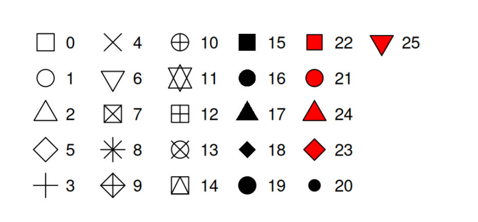

> 简介
> 
> 
> 在 `ggplot2` 中，点图（`geom_point()`）的符号由 `shape` 参数控制，支持 0–25 共 26 种内置图形。本篇汇总所有 shape 编号与对应符号，演示如何用 `scale_shape_manual()` 自定义映射。
> 

---

## 1. 内置形状对照表

下图展示了 `ggplot2` 默认 0–25 的所有点形状及编号：



---

## 2. 示例：将组别映射到不同形状

```r
library(ggplot2)

# 示例数据
df <- data.frame(
  x = rep(1:5, each = 3),
  y = rnorm(15),
  group = factor(rep(letters[1:3], times = 5))
)

# 默认形状（0,1,2...自动循环）
ggplot(df, aes(x, y, shape = group, colour = group)) +
  geom_point(size = 4) +
  labs(title = "默认 group→shape 映射")

```

---

## 3. 自定义形状映射

使用 `scale_shape_manual()` 可以精确指定每个组对应的 shape 编号或字符：

```r
ggplot(df, aes(x, y, shape = group, colour = group)) +
  geom_point(size = 4) +
  scale_shape_manual(
    values = c(
      a = 15,  # ■
      b = 17,  # ▲
      c = 19   # ●
    )
  ) +
  labs(title = "自定义 group→shape 映射")

```

- `values` 可接受整数（0–25）或单字符（如 `"+"`）
- 常配合 `scale_colour_manual()` 一起使用，形成一致的视觉风格

---

## 4. 常见应用

- **多类别散点图**：当颜色受限时，用 shape 区分
- **黑白打印**：结合 shape 与填充映射，保证单色模式下可辨识
- **组合图形**：在 `facet_*()` 或 `patchwork` 多图布局中，用 shape 强调不同子集

---

> 小贴士
> 
> - 透明度：`geom_point(alpha = 0.6)`
> - 大小：`aes(size = some_var)`
> - 字符：除了数字编码，还能用字符串（如 `"A"`, `"*"`, `"+"`）
> - 参考：`?points` 查看更多 R 基本绘图符号
