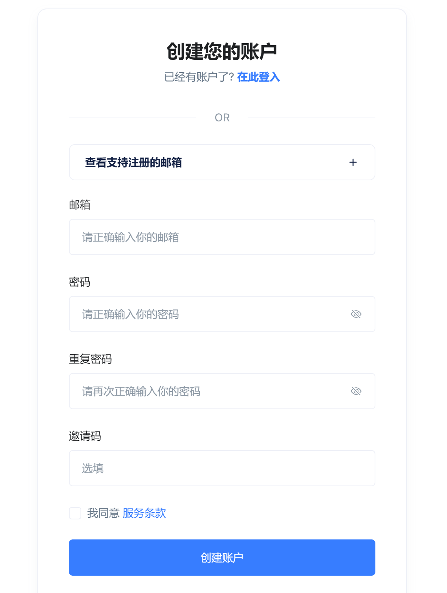
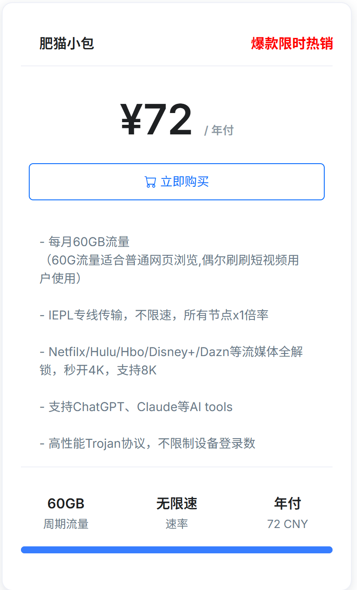
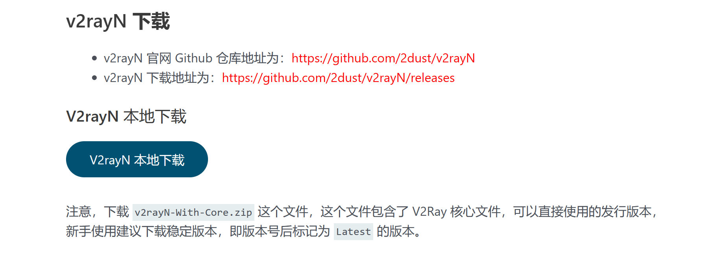
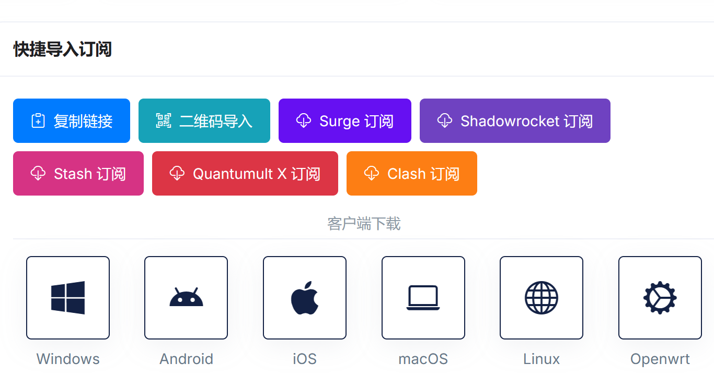
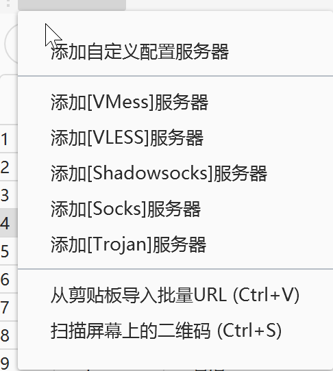

> 💡 本文旨在为大陆用户提供一套简单、安全、实用的科学上网配置方案，帮助你顺利连接全球互联网，访问 ChatGPT、Google、YouTube、GitHub 等核心资源。
> 

---

## 📖 背景说明

在信息高度全球化的时代，很多优质工具和知识资源都托管于境外平台，例如：

- 🔍 **Google Scholar**：学术搜索引擎
- 💬 **ChatGPT**：AI 辅助对话助手
- 🧑‍💻 **GitHub**：开发者代码托管平台
- 📺 **YouTube**：海量学习与公开课程资源

由于网络访问限制，这些服务在大陆无法直接访问。“科学上网”正是一种解决方案，帮助用户安全合规地访问这些重要服务。

---

## 🧰 工具准备

| 工具/资源 | 用途 | 推荐方式 |
| --- | --- | --- |
| 科学上网服务（机场） | 提供代理节点 | 如肥猫云、魔戒机场、喵帕斯等 |
| 客户端软件 | 加载订阅并连接代理 | Windows：v2rayN；macOS：ClashX；iOS：Shadowrocket |
| 邮箱 | 注册 ChatGPT / Google 等 | 强烈建议使用 Gmail，稳定性和兼容性高 |
| 稳定网络环境 | 保证连接稳定性 | 家宽网络最佳，避免校园网或需认证的公共网络 |

---

## ✈️ 选择并注册机场服务

机场是指提供代理节点服务的服务商。常见套餐包括月付、季付和年付，适合不同需求。以肥猫云为例：

1. 打开注册链接：
    
    [👉 https://ca03.fcvipaff.pro/register](https://ca03.fcvipaff.pro/register)
    
2. 填写邮箱、密码，输入邀请码 `KjPj7zUw`（如需）
    
    
    
3. 登录后点击左侧菜单「购买订阅」，选择套餐并付款（推荐年付小包）
    
    
    
4. 在后台获取订阅链接或二维码，用于导入客户端

---

## 💻 安装与配置客户端（以 Windows 为例）

1. 下载 v2rayN 客户端：
    
    https://v2rayn.org/v2rayn-official
    
    
    
2. 解压并运行 `v2rayN.exe`，如提示需安装 .NET 环境，按指引完成安装
3. 启动软件 → 点击「订阅」 → 添加订阅链接（复制自机场后台）
    
    
    
4. 更新订阅 → 右键任一节点设为活动服务器 → 启动服务
    
    
    
5. 成功后浏览器可访问 [Google](https://www.google.com/) 或 [ChatGPT](https://chat.openai.com/)

---

## 🍎 macOS 与 iOS 用户配置

| 系统 | 客户端推荐 | 获取方式 |
| --- | --- | --- |
| macOS | ClashX | [ClashX 下载地址](https://github.com/yichengchen/clashX/releases) |
| iOS | Shadowrocket / Stash | App Store（需美区 Apple ID） |
- 如无美区 Apple ID，可通过 [appleid.apple.com](https://appleid.apple.com/) 注册一个新的账号，参考教程 [创建美区 Apple ID](https://docs.evanzhou.org/sops/create-us-apple-id)

---

## 🔐 常见协议简介

不同机场使用的协议略有不同，常见协议如下：

- **Vmess/V2Ray**：目前最主流协议，适用于绝大多数客户端
- **Shadowsocks (SS)**：轻量协议，配置简单
- **Trojan**：基于 HTTPS，隐蔽性更强
- **WireGuard**：速度快，但配置略复杂，适合移动端或高需求用户

用户通常无需手动配置，机场会提供订阅链接，一键导入即可。

---

## 🧩 常见问题解答（FAQ）

| 问题 | 解答说明 |
| --- | --- |
| 连不上怎么办？ | 检查订阅是否正确导入、服务是否启动、网络是否可用 |
| 可以多个设备同时用一个订阅吗？ | 可以，建议避免同时使用同一节点 |
| 哪个节点更稳定？ | 香港、台湾、新加坡等节点通常延迟较低 |
| 有哪些机场推荐？ | 肥猫云、**WgetCloud**等（建议低调使用，注意合规） |

---

## 🎯 可以做些什么？

一旦配置成功，你就可以：

- ✅ 畅通使用 ChatGPT（推荐搭配 Plus 订阅）
- ✅ 注册并使用 Gmail、Google Scholar、YouTube 等
- ✅ 下载 GitHub 项目与使用开发者工具
- ✅ 学习国际课程、公开课、AI 工具等

---

## 🧭 总结

“科学上网”不仅仅是一个技术操作，更是一种保持信息自由、接触世界、拓展视野的方式。它打开的是更广阔的学习空间、更高效的工作渠道，以及更直接的与世界对话的机会。

希望这篇指南能成为你开启自由互联网旅程的第一步。
