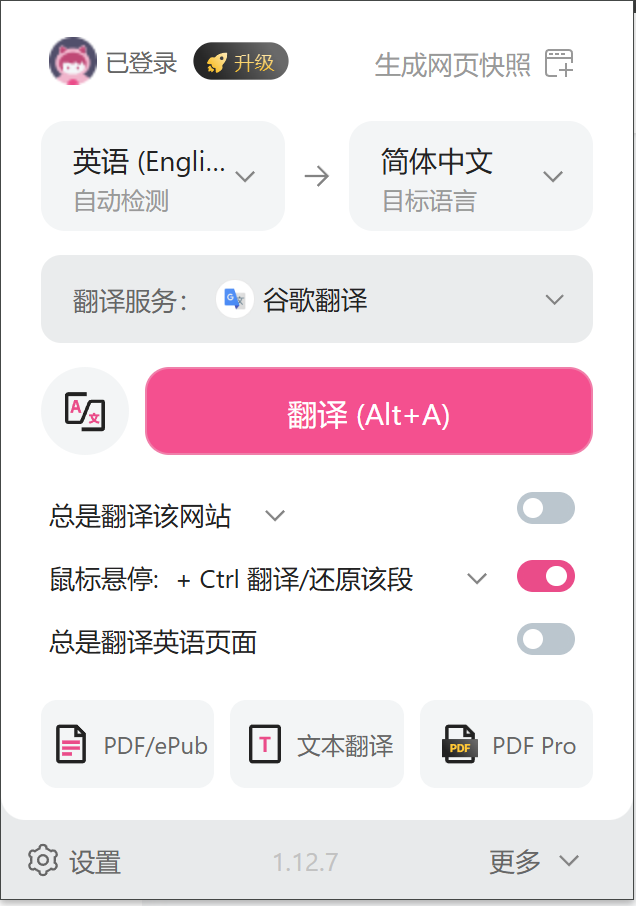
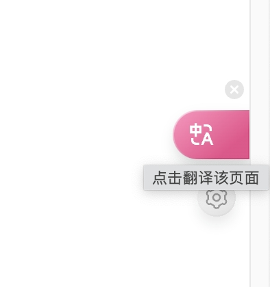
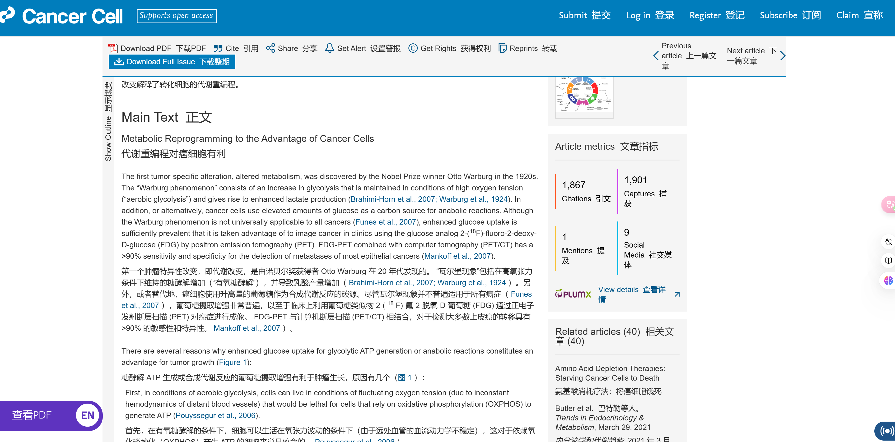
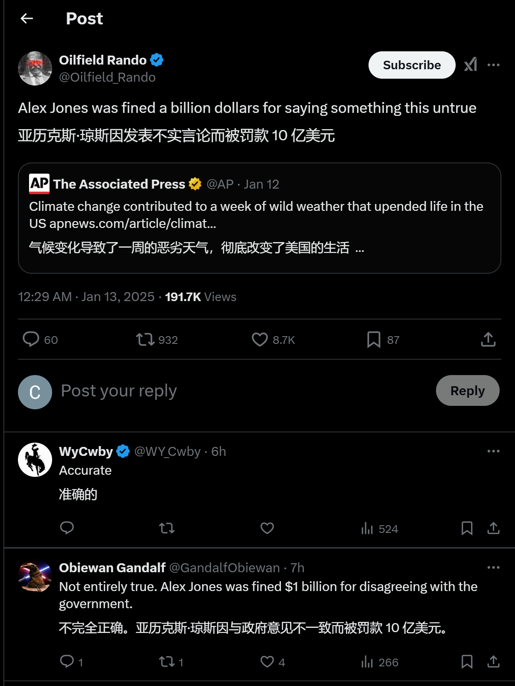

随着全球化发展和多语言场景的普及，翻译工具已成为我们生活和工作的不可或缺的一部分。然而，大多数翻译工具以独立应用或有限的网页插件形式存在，难以实现真正的无缝沉浸式体验。今天，我们将重点介绍一款优秀的开源浏览器插件——**Immersive Translate**。它不仅提供高效、即时的翻译功能，还支持丰富的个性化设置，为用户带来更加顺畅的跨语言交流和学习体验。

---

### 项目介绍

**Immersive Translate** 是一款专为快速、准确翻译文本设计的开源浏览器插件。它以用户体验为核心，旨在实现实时无缝翻译，非常适合阅读外语文献、浏览海外网站或从事跨语言协作的场景。
**核心功能亮点：**

- **即时翻译：** 无需复制粘贴，只需选中文字即可显示翻译结果。
- **多种语言支持：** 提供超过 100 种语言的双向翻译。
- **个性化配置：** 支持用户自定义字体、背景颜色等，优化阅读体验。
- **多场景适配：** 无论是网页阅读、邮件撰写还是社交媒体互动，均可轻松使用。
- **开源透明：** 通过 GitHub 提供的代码库，用户可以了解其实现原理并参与改进。

---

### 安装与快速上手

### **1. 安装**

- **推荐方式：** 直接访问浏览器的插件商店，搜索 **Immersive Translate** 并安装，确保自动更新。
- **手动方式：** 前往 [GitHub 项目页面](https://github.com/immersive-translate/immersive-translate)，下载插件文件并按照页面指引手动安装。

### **2. 快速上手**

1. 安装完成后，点击浏览器右上角扩展图标，进入插件设置界面。
2. 配置翻译语言对、快捷键及显示模式（如覆盖原文或并排显示）。
3. 打开任意网页，选中文本即可查看翻译结果；按快捷键可翻译整页内容。

### 核心功能解析

1. **智能翻译显示：**
Immersive Translate 的亮点在于其“沉浸式体验”，翻译结果可以根据用户需求以悬浮窗口、侧边栏或原文替换等形式呈现，不影响原始网页的整体排版。
    
    
    
    
    
2. **无缝工作流：**
通过简单的快捷键，用户可以快速激活翻译功能，同时支持浏览器内文档翻译，省去切换窗口的繁琐。
    - Alt+A: 翻译/切换原文，按一下翻译，再按一下显示原文。
    - Alt+W: 翻译整个页面，而不是默认的智能翻译内容区域。
3. **隐私保护：**
插件承诺不会记录用户的翻译内容，并支持通过本地 API 完成翻译请求，为用户提供安全可靠的使用环境。
4. **开源社区支持：**
Immersive Translate 的 GitHub 项目页面不仅提供详尽的安装和使用指南，还欢迎开发者提交 issue 和 pull request，与社区共同打造更加完善的工具。

---

### 为什么选择 Immersive Translate？

相比传统翻译工具，Immersive Translate 的独特之处在于其用户体验的高度优化。以下是用户选择它的三大理由：

1. **高效：** 无需打开额外的翻译页面，快速翻译节省时间。
2. **定制化：** 满足不同用户的语言需求和界面偏好。
3. **免费开源：** 完全免费且代码透明，用户可以信赖其安全性。

---

### 使用场景与实践经验

**1. 学术研究：**

学生和研究人员可以利用 Immersive Translate 快速翻译外文文献中的关键段落，同时保留原文排版，方便引用和比对。这对于阅读复杂的专业术语或多学科交叉的内容尤为高效。

**2. 跨境电商：**

在浏览海外购物网站、查看商品详情或与外商进行商务交流时，即时翻译功能能够快速破除语言障碍，让跨境购物和沟通更加顺畅。

**3. 语言学习：**

Immersive Translate 支持逐句翻译功能，用户可以在阅读文章或观看外语内容时逐句学习语法和单词用法，结合原文和译文有效提升语言水平。

**4. 视频双语字幕：**

插件支持为 YouTube 视频提供实时双语字幕，无论是观看学术讲座还是娱乐视频，用户都可以同时获取外语字幕和翻译内容，既能享受沉浸式观看体验，又能学习外语表达。

**5. 社交软件翻译：**

在聊天工具或社交媒体中（如 Twitter、LinkedIn 等），插件可以快速翻译消息或帖子，助力用户跨语言社交和实时参与国际讨论。

Immersive Translate 的强大功能覆盖多种场景，从学习到工作，从娱乐到交流，让翻译真正融入到每一位用户的日常生活中。

---

### 未来展望

Immersive Translate 的出现不仅改变了我们对翻译工具的期待，还展示了开源社区在生产力工具开发中的潜力。随着更多开发者的加入和技术的进步，这款插件在翻译精度、UI 设计以及多场景适配上将迎来进一步的提升。

---

### 结语

无论是工作中的多语言协作，还是日常生活中的语言学习，**Immersive Translate** 都是值得尝试的一款翻译工具。通过它，跨越语言鸿沟不再是挑战，而是一次次无缝沟通的全新体验。如果你也对这款插件感兴趣，不妨前往 [GitHub](https://github.com/immersive-translate/immersive-translate) 下载并亲自体验！

**快来尝试 Immersive Translate，开启沉浸式翻译之旅吧！**
