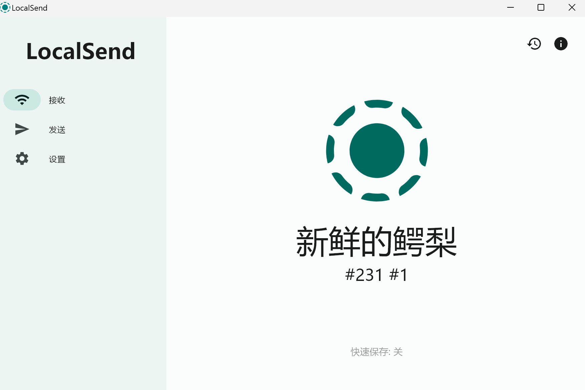
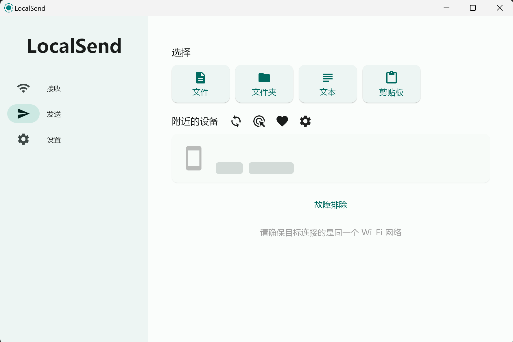

在日常生活和工作中，文件传输是每个人都会遇到的需求，尤其是在手机和电脑之间共享文件时，常常令人头疼。很多人会习惯使用微信或 QQ 来传输文件，但这些工具存在明显的局限性：

- **速度慢**：尤其是大文件，上传和下载都需要很长时间。
- **质量受损**：例如图片和视频常被压缩，影响使用效果。
- **操作复杂**：需要提前登录账户、找到好友或设备，有时甚至会遇到文件过期的问题。

如果你也为这些问题困扰，不妨试试 **LocalSend**。作为一款专注于局域网文件传输的神器，LocalSend 让你在不同设备间传输文件变得高效、快速且无损，特别是 iOS 和 Windows 设备之间的跨平台传输，体验尤为流畅！

---

### **1. 什么是 LocalSend？**

LocalSend 是一款 **免费、开源且跨平台** 的文件传输神器，支持 **iOS、Android、Windows、Mac 和 Linux** 等主流设备。它采用局域网直接点对点传输文件的方式，**无需登录账户，也不依赖第三方云端**，不仅安全性高，速度更快，还拥有令人耳目一新的简洁界面设计。

无论是小型文件还是数 GB 的大文件，LocalSend 都能轻松搞定，并且完美解决了微信和 QQ 传输方式的痛点：

- **文件无损**：不会自动压缩图片或视频，确保质量不受影响。
- **速度极快**：基于局域网传输，速度完全取决于 WiFi 的带宽。
- **操作简单**：无需登录、无需查找联系人，直接设备互连。
    
    
    

---

### **2. 为什么要特别推荐 iOS 到 Windows 的传输？**

在跨设备传输场景中，**iOS 和 Windows 之间的文件共享常常是最让人头疼的**：

- iOS 没有原生的文件共享功能可以直接对接 Windows；
- AirDrop 只能用于苹果生态设备；
- 微信和 QQ 的文件传输则面临上述的速度和质量问题。

而 **LocalSend** 提供了一个无缝的解决方案：

- **简单高效**：只需两台设备连接同一网络，无需额外软件支持。
- **速度无敌**：局域网传输速度通常高于云端方式的 5-10 倍。
- **隐私保障**：所有传输均在本地网络内完成，数据不会上传到服务器。

---

### **3. 使用 LocalSend 进行 iOS 到 Windows 文件传输**

以下是一个常见的使用场景：**在 iPhone 和 Windows 电脑之间传输文件**。

1. **确保设备连接到同一网络**：两台设备需在同一 WiFi 下，或使用手机热点让另一台设备连接。
2. **安装 LocalSend**：
    - 在 iPhone 上打开 App Store，搜索并安装 LocalSend。
    - 在 Windows 上访问 [LocalSend 官网](https://localsend.org/) 下载并安装客户端。
3. **开始传输文件**：
    - 在 iPhone 上打开 LocalSend，选择需要发送的文件、文件夹、文本或剪贴板内容。
    - LocalSend 会自动扫描同一网络中的设备，在设备列表中选择目标 Windows 电脑。
    - 点击目标设备，即可开始文件传输，速度快且不损失文件质量。
    
    
    

---

### **4. 使用场景**

除了 iOS 到 Windows 的传输，LocalSend 也适用于多种设备间的文件共享场景：

- **手机到电脑**：快速传输照片、视频或文档，无需数据线。
- **电脑到电脑**：支持 Windows、Mac 和 Linux 间的无缝共享。
- **手机到平板**：方便在多设备间共享媒体文件或学习资料。

> 特别提醒：LocalSend 依赖 局域网连接 进行传输。因此：
> 
> - 使用家庭路由器或手机热点时效果最佳；
> - 校园网等公共网络可能由于网络隔离导致传输失败，此时可以尝试用手机热点连接设备。

---

### **5. LocalSend 的优点和不足**

- **优点**：
    - 完全免费，且开源。
    - 支持多种平台，覆盖面广。
    - 文件传输速度快，无需依赖服务器。
    - 界面简洁，使用门槛低。
- **不足**：
    - 必须在同一局域网下，无法实现远程传输。
    - 特殊网络环境（如校园网）可能需要调整网络设置。

---

### **6. 总结**

作为一款跨平台文件传输工具，**LocalSend 凭借其简约的界面、极快的传输速度和无与伦比的便捷性，真正做到了“跨设备传输无压力”**。特别是在 iOS 和 Windows 之间的文件传输场景中，LocalSend 的表现可以说是无敌强大：

- **界面简约✨**：操作逻辑清晰明了，几步即可完成文件发送和接收，相当清新！
- **传输速度快⚡**：基于局域网，文件传输速度远超传统云端工具。
- **隐私保护🔒**：数据不经过云端，仅在本地网络中传输，安全可靠。
- **跨平台兼容🌐**：支持多种设备，轻松覆盖你日常使用的生态圈。

相比微信和 QQ 的繁琐操作以及文件压缩限制，LocalSend 让文件传输变得前所未有的轻松高效。如果你也需要一款高效的传输工具，**LocalSend 将成为你的新宠！**

---

**欢迎加入 LocalSend 的用户讨论，以下是相关链接：**

- [LocalSend 官网](https://localsend.org/)
- [LocalSend GitHub 项目](https://github.com/localsend/localsend)
- [LocalSend 中文社区](https://github.com/localsend/localsend/discussions)

如果在使用过程中有任何问题或建议，也欢迎随时在 LocalSend 社区中留言讨论。让我们一起见证这一神器的不断成长与优化！🎉
