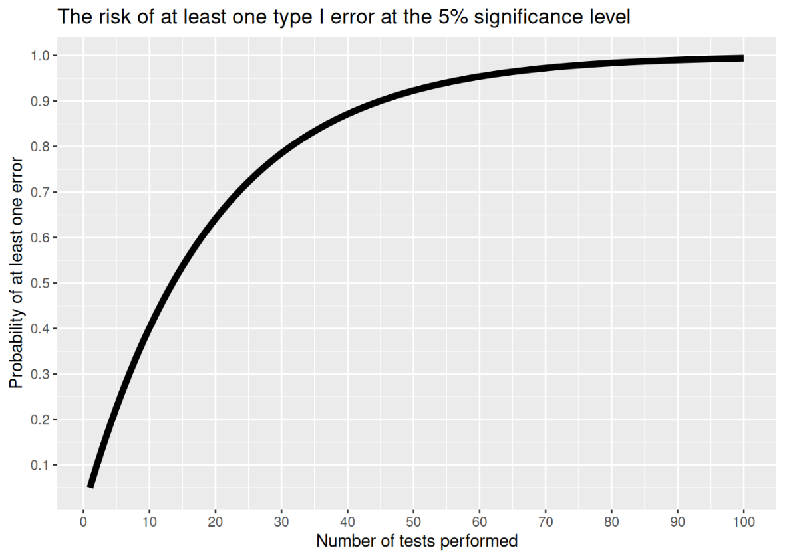

在数据分析和科学研究中，我们经常要进行许多假设检验，比如 t 检验、卡方检验等。每做一次检验，都有一定概率出现“假阳性”（即本不显著却被判定为显著）。**如果我们同时做很多次检验，错误发现的概率就会大大增加**，这就是“多重检验”问题。

---

## 1. 为什么需要多重检验校正？

在假设检验中，通常我们设定显著性水平（α），比如 0.05，表示**每次检验出现 I 型错误（假阳性）的概率**为 5%。

然而，当我们在同一分析中**进行多次独立检验**时，虽然每个检验单独来看仍是 0.05，但**整个家族（所有检验）中至少出现一次假阳性的概率（家族错误率，FWER）会远高于 0.05**。

例如，假设你独立地进行了 20 次检验，每次显著性水平都是 0.05，即使所有原假设都为真，**至少出现一次假阳性的概率**为：

$$
\text{FWER} = 1 - (1-0.05)^{20} \approx 0.64
$$

这说明，随着检验次数的增加，出现“至少一个假阳性”的整体风险显著上升。

**核心问题：**

- 每次独立检验的显著性水平无法保证整体的假阳性风险（家族错误率，FWER）
- 多次假设检验时，未经校正，分析结果中出现偶然“显著”的概率被大大高估

> 多重检验问题广泛存在于转录组差异分析、GWAS 全基因组关联分析、问卷多项分析、临床多终点比较等领域。
> 



> 图片来自 Thulin, M. (2024). *Modern Statistics with R*. Second edition. Chapman & Hall/CRC Press. ISBN 9781032512440.
> 

---

## 2. 多重检验的统计学基础

如上所述，多重检验会使我们整体分析中**出现假阳性的风险大幅上升**。为了科学地描述和控制这种风险，统计学中引入了多个相关概念，最常用的是**I 型错误率（Type I error）、家族错误率（FWER）和假发现率（FDR）**。

### 2.1 I 型错误和 FWER

- **I 型错误（Type I error）**：在单次假设检验中，将本来为真的零假设错误地拒绝（即“假阳性”）。
- **家族错误率（FWER, Family-wise Error Rate）**：在一次包含多重假设检验的分析中，**至少出现一个 I 型错误的概率**。FWER 描述了多重检验时的整体假阳性风险。

### 2.2 FDR（False Discovery Rate）

- **FDR（假发现率）**：在所有被判定为显著的结果中，实际上为假阳性的比例。相比于 FWER，FDR 更适合大规模检验场景（如组学分析），既能控制假阳性，又能保证一定的发现能力。
- **FDR 校正方法**（如 Benjamini-Hochberg）在生信、医学等大数据分析中广泛应用。

---

## 3. 常见的多重检验校正方法

### 3.1 Bonferroni 校正

- **原理**：将整体显著性水平 α 除以检验次数 m，每个单独检验采用更严格的阈值，例如，α = 0.05，m = 10，则每次检验的阈值为 0.005。
- **优点**：非常严格，能有效控制家族错误率（FWER），适用于对假阳性高度敏感的场景。
- **缺点**：过于保守，特别是在检验次数较多时，容易遗漏真正的差异（假阴性偏高）。

### 3.2 Holm 校正

- **原理**：Bonferroni 的改进方法。将所有 p 值从小到大排序，逐步调整。是 step-down（递减）型校正。
- **优点**：比 Bonferroni 宽松一些，同时依然严格控制 FWER。
- **缺点**：在大量检验时仍较为保守，但发现能力更强于 Bonferroni。
- **应用**：推荐用于常规多重检验场景，既安全又不至于过度压制阳性发现。

### 3.3 Benjamini-Hochberg (BH) FDR 校正

- **原理**：针对“假发现率”而不是 FWER 进行控制。所有 p 值排序后，找到最大的满足条件的 p 值及其前面所有均认为显著。
- **优点**：兼顾假阳性风险与检验灵敏度，尤其适合组学大数据、大量假设检验场景（如差异基因、GWAS）。
- **缺点**：允许有部分假阳性，通过 FDR 率来控制“总体比例”，但单个显著性结果的置信度略低于 FWER 校正。
- **应用**：组学数据分析、生信差异分析的主流校正方法。

### 3.4 其他常用方法

- **Sidak 校正**：Bonferroni 的改进，假设独立性强时比 Bonferroni 稍宽松。
- **Benjamini-Yekutieli 校正**：FDR 的保守扩展，适用于有依赖关系的数据。
- **q-value 方法**：直接给出每个结果的最小 FDR，适合需要显式 FDR 值判断的分析。

---

**实用建议：**

- 检验数目少、关注假阳性 → Bonferroni/Holm
- 大数据、组学场景 → Benjamini-Hochberg FDR
- 有依赖或特殊需求 → Benjamini-Yekutieli、q-value

---

## 4. 代码实战：R 快速实现多重检验校正

最常用的 R 函数是 `p.adjust()`，支持多种校正方法。

```r
# 假设你有一组 p 值
pvals <- c(0.003, 0.2, 0.04, 0.12, 0.001, 0.9)

# Bonferroni 校正
p.adjust(pvals, method = "bonferroni")

# Holm 校正
p.adjust(pvals, method = "holm")

# FDR (Benjamini-Hochberg)
p.adjust(pvals, method = "BH")

```

在生信分析包里（如 DESeq2、limma、edgeR），差异分析输出表通常自带校正后的 p 值（如 padj、adj.P.Val、FDR）。

> 小技巧：
> 
> - 大规模检验推荐 FDR（BH）方法
> - 小样本、特别关注假阳性的场景可考虑 Bonferroni 或 Holm

---

## 5. Hotelling’s T² 检验：多变量假设检验的进阶方法

在实际数据分析中，我们经常不止关心一个变量的差异，而是想要比较两组在**多个变量上的均值**是否同时存在显著差异。如果对每个变量单独做 t 检验，不仅要面对多重检验校正的问题，还无法利用变量之间的相关性信息。这时，多元检验方法就派上了用场，最常见的就是 **Hotelling’s T² 检验**。

### 5.1 Hotelling’s T² 检验是什么？

想象你有两组人：**男性**和**女性**，你分别测量了每个人的**血压、血糖和胆固醇**。你的问题是：

> “男女两组人在这些健康指标的整体水平上有没有统计学上的显著差异？”
> 

如果用传统做法，你可能会分别对血压、血糖、胆固醇做三次 t 检验，但这样既需要多重检验校正，也忽略了这些健康指标之间的相关性（比如高血糖往往伴随高胆固醇）。

**Hotelling’s T² 检验**的作用，就是一次性考察**所有指标联合的均值向量**，来判断这两组人在“健康特征”整体上是否有差异。

其他场景还包括：

- 比较两组患者在多项临床指标上的综合差异（如术前与术后，吸烟者与非吸烟者）
- 教育领域：比较不同教学方法下学生的多科成绩均值
- 心理学：比较两组人在多个心理量表（如焦虑、抑郁、自尊）上的总体差异

### 5.2 R 语言实现 Hotelling’s T² 检验

以下以 airquality 数据为例，比较 6 月和 7 月的臭氧、太阳辐射、风速和温度的均值是否存在显著差异。

```r
# 安装和加载 Hotelling 包
install.packages("Hotelling")
library(Hotelling)

# 筛选两个月份的数据
aq_june  <- subset(airquality, Month == 6, select = c(Ozone, Solar.R, Wind, Temp))
aq_july  <- subset(airquality, Month == 7, select = c(Ozone, Solar.R, Wind, Temp))

# 进行 Hotelling’s T² 检验
result <- hotelling.test(aq_june, aq_july)
print(result)

```

**输出解释：**

检验结果会给出 T² 统计量、自由度、对应的 F 检验结果和 p 值。如果 p 值小于 0.05，说明两个月份在这四个变量上的**整体均值**存在显著差异。

### 5.3 Hotelling’s T² 检验 vs. 多重 t 检验

- **Hotelling’s T² 检验**
    - 一次性检验多组变量的**均值联合差异**，回答“整体上，两组在这些变量的表现是否有显著不同？”
    - 能更好地控制家族错误率（FWER），避免因为多次单变量检验带来的假阳性堆积。
    - 充分利用变量之间的相关性，提高检验的统计效能（如变量之间有强相关时更具优势）。
    - 更适合关注“整体特征”而不是单个变量的场景。
- **多个 t 检验**
    - 分别对每个变量进行单独的 t 检验，针对每个变量只关注单一差异。
    - 需要进行多重检验校正（如 Bonferroni、FDR），否则容易出现家族错误率显著升高的问题。
    - 变量间信息完全独立处理，无法发现“组合效应”或变量之间的联合变化。
    - 适合只关心单个变量或变量之间相互独立时的分析。

---

**小结：**

Hotelling’s T² 检验关注多变量“整体差异”，统计效率更高，假阳性风险更低；多个 t 检验虽然直观，但在变量多、相关性强或需要综合判断时，容易失去重要信息和科学性。
