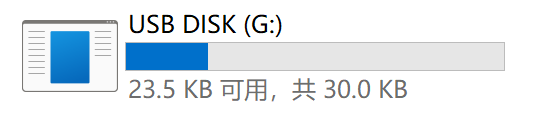
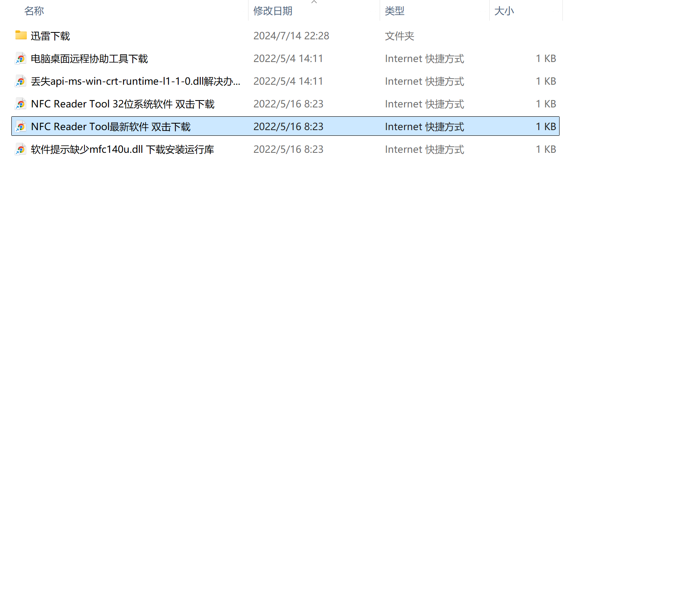
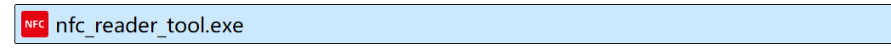
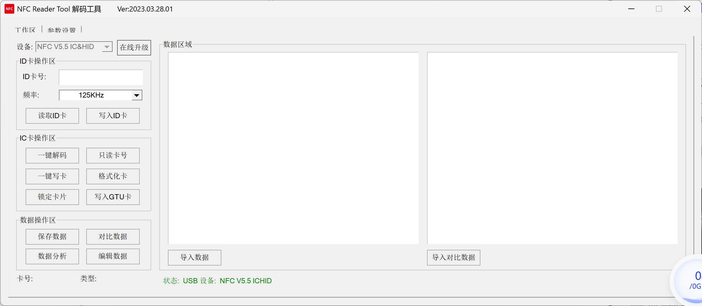

### 🧰 所需准备

- 一台运行 Windows 系统的电脑（推荐 Win10 或以上）
- USB RFID 读卡器一台
- 原始NFC卡（待复制卡）
- 空白NFC卡（目标卡）
- **NFC Reader Tool 软件**

---

### 📦 软件安装步骤

1. **接入设备**
    
    将读卡器通过 USB 插入电脑，系统将自动识别设备。
    
2. **访问内置U盘**
    
    插入设备后，系统会弹出一个虚拟U盘（或名为“USB Disk”的磁盘）。该磁盘内含配套软件。
    
    
    
3. **复制软件到本地**（推荐）
    
    打开磁盘，找到 `NFC Reader Tool最新软件 双击下载.exe` ，双击下载到本地目录例如 `D:\NFC_Tools`
    
    
    
4. **运行软件**
    
    双击 `nfc_reader_tool.exe`，打开 NFC Reader Tool，无需安装，直接运行。
    
    
    
    
    

---

### 🧭 操作流程

### 第一步：读取原始卡片数据

- 将**原始卡片**（要复制的卡）放在读卡器上
- 听到“**滴**”的一声，表示设备已成功识别卡片
- 在软件中点击【一键解码】
- 卡片信息会显示在右侧数据区域
- 点击【保存数据】，将数据导出并保存为 `.dump` 文件，命名如：`card_original_20250616.dump`

### 第二步：准备空白卡片

- 移除原卡，放置**空白NFC卡**
- 听到“**滴**”的一声，确认识别成功
- 点击【格式化卡】，清空卡片数据

### 第三步：写入数据到空白卡

- 点击【导入数据】，选择刚才保存的 `.dump` 原卡数据文件
- 点击【一键写卡】，完成数据写入
- 写卡成功

### 第四步：验证复制是否成功

- 保持复制完成的卡片放在读卡器上
- 点击【一键解码】，再次读取该卡片
- 点击【导入对比数据】，加载原始卡片数据文件
- 点击【对比数据】，若提示“**数据一致**”，即为复制成功！

---

### 💡 小提示

- 软件无需联网即可使用，但可选择点击右上角【在线升级】更新版本
- 操作过程中如遇无法识别卡片，请调整卡片位置或重启软件
- 建议每次写卡后**立即验证**，确保数据准确
- 所保存的 `.dump` 数据文件应备份，便于后续再次写入
