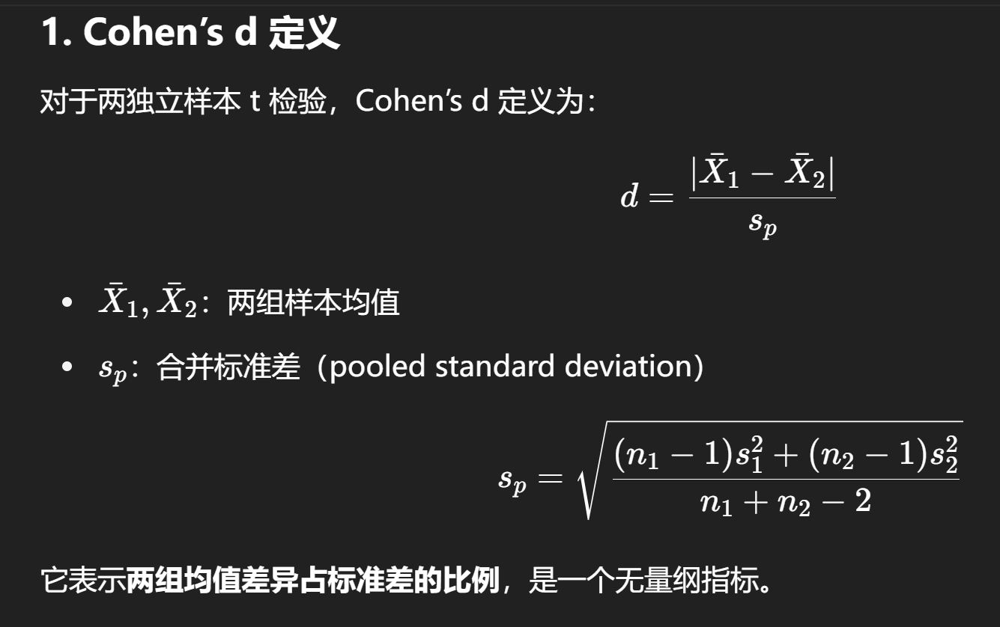

## 统计功效分析（Power Analysis）的核心问题

统计功效分析是实验设计和统计推断中的重要环节，主要用于回答以下两个关键问题：

1. **在假设真实存在效应的情况下，检验能否正确拒绝零假设（H0）？**
    - 当研究对象确实存在某种差异或关系时，我们希望统计检验有足够的能力（功效）去识别它。
    - 如果功效太低，即使存在真实效应，检验也可能无法发现（假阴性）。
2. **为了达到一定的功效水平（通常设定为 80% 或 90%），需要多少样本量？**
    - 在研究开始前，我们可以通过功效分析来确定所需的样本量。
    - 这能避免样本太少导致无法检测效应，或样本太多造成资源浪费。

---

### 1. 功效（Power）的定义

- 统计功效是衡量统计检验**检测真实效应能力**的指标。它定义为：
    
    $$
    Power=1−β
    $$
    
    其中：
    
    - β = II 型错误率（真实效应存在时却未能拒绝 H0 的概率）
    - **功效（Power）**：当真实效应存在时，检验正确拒绝零假设的概率。
- 功效越高 → 检验越敏感 → 更容易发现真实效应。
- 功效低 → 容易出现 **假阴性（False Negative）**：
    - 例如药物确实有效，但由于样本量不足或噪声太大，检验无法检测到显著差异。
- 通常要求80%以上，高风险领域（如临床试验）可能要求功效达到 90% 或更高。

---

### 2. 功效与错误类型的关系

- **I 型错误（α）**：当 H0 为真时，错误地拒绝 H0
- **II 型错误（β）**：当 H1 为真时，错误地保留 H0
- 错误率之间的权衡
- 当我们降低 α（设定更严格的显著性水平，例如从 0.05 降到 0.01）：
    - 检验变得更保守
    - 假阳性（I 型错误）风险下降
    - 但容易错过真实效应 → II 型错误 β 增加 → 功效下降
- 为了保持高功效，可以：
    - 增加样本量
    - 提高显著性水平（例如 α = 0.10）
    - 或增加效应大小（例如改善实验设计，减少噪声）
    
    ```
    
    低 α （严格）:    I 型错误 ↓   II 型错误 ↑   功效 ↓
    高 α （宽松）:    I 型错误 ↑   II 型错误 ↓   功效 ↑
    
    ```
    

---

### 3. 影响功效的因素

统计功效（Power）受到多种因素的共同影响，主要包括以下五类：

### a. **效应大小（Effect Size）**

- **定义**：效应大小是衡量真实差异强度的指标，例如：
    - 两组均值差异（Cohen's d）
    - 分类变量关联强度（Cramér's V）
    - 相关性大小（Pearson’s r）
- **影响**：
    - 效应大 → 观测差异显著 → 检验容易发现 → 功效高
    - 效应小 → 差异微弱 → 需要更多样本才能检测

---

### b. **样本量（Sample Size）**

- 样本量越大：
    - 参数估计更精确（标准误差减小）
    - 检验统计量更稳定
    - 检测真实差异的能力增强
- **经验法则**：功效不足时，首先考虑增加样本量。

---

### c. **显著性水平（α）**

- α 决定拒绝域的位置：
    - 提高 α（例如从 0.05 到 0.10）→ 更容易拒绝 H0 → 功效提高
    - 降低 α（例如从 0.05 到 0.01）→ 检验更严格 → 功效下降
- 在高风险领域通常保持较低 α（降低假阳性风险），但需要更大样本量保持功效。

---

### d. **数据波动（标准差 / Variability）**

- 数据中噪声大、变异高 → 难以区分效应和随机波动 → 功效下降
- 降低变异的方法：
    - 改进测量工具
    - 控制外部变量
    - 使用配对设计减少个体差异

---

### e. **检验类型（Test Type）**

- **单侧检验**：
    - 拒绝域集中在分布一端
    - 对单方向效应更敏感 → 功效高于双侧
- **双侧检验**：
    - 拒绝域分布在两端
    - 功效稍低，但更保守，适用方向不确定的研究

---

## 4. 已知样本量如何计算功效

当研究已经确定了样本量时，可以计算当前设计在给定效应大小下的统计功效。

### 示例：两独立样本 t 检验

- 每组样本量 = 30
- 假设效应大小 d=0.5（中等效应）
- 显著性水平 α=0.05

---

**R 代码：**

```r
library(pwr)

# 计算功效
pwr.t.test(n = 30, d = 0.5, sig.level = 0.05,
           type = "two.sample", alternative = "two.sided")

```

**输出：**

```

     Two-sample t test power calculation 

              n = 30
              d = 0.5
      sig.level = 0.05
          power = 0.4778965
    alternative = two.sided

NOTE: n is number in *each* group
```

**解释：**

- 在每组 30 个样本、差异为 0.5 标准差时，检验有约 48% 的概率正确拒绝 H0。
- 功效不足时，可能需要增加样本量或选择单侧检验。

> 这里的 d 指的是 **Cohen’s d**，是统计学中衡量两组均值差异大小的标准化指标，也是功效分析中最常用的**效应大小（Effect Size）**。
> 



### Cohen’s d 取值范围

- d=0.2：小效应（Small）
- d=0.5：中等效应（Medium）
- d=0.8：大效应（Large）

举例：

- 两组均值差 = 5 mm
- 合并标准差 = 10 mm
- d=5/10=0.5，属于中等效应。

### 在 R 中计算 Cohen’s d

```r
library(effsize)

cohen.d(flipper_length_mm ~ sex, data = penguins)

```

输出：

```

d estimate: -0.5262441 (medium)
95 percent confidence interval:
     lower      upper 
-0.7455516 -0.3069365 
```

---

## 5. 预设功效如何估计所需样本量

如果研究目标是达到某一功效水平（例如 80%），可以反向计算所需样本量。

### 示例：两独立样本 t 检验

- 目标功效 = 80%
- 假设效应大小 d=0.5
- 显著性水平 α=0.05

**R 代码：**

```r
library(pwr)

# 计算所需样本量
pwr.t.test(d = 0.5, power = 0.8, sig.level = 0.05,
           type = "two.sample", alternative = "two.sided")

```

**输出：**

```
     Two-sample t test power calculation 

              n = 63.76561
              d = 0.5
      sig.level = 0.05
          power = 0.8
    alternative = two.sided

NOTE: n is number in *each* group

```

**解释：**

- 每组需要大约 64 个样本，才能以 80% 的功效检测中等差异。
- 总样本量约 128 个。

---

### 常用情境

- 临床试验设计：确定最少入组人数
- 社会学调查：控制统计敏感度和经费
- 小样本研究：提前估算功效，判断是否可行
