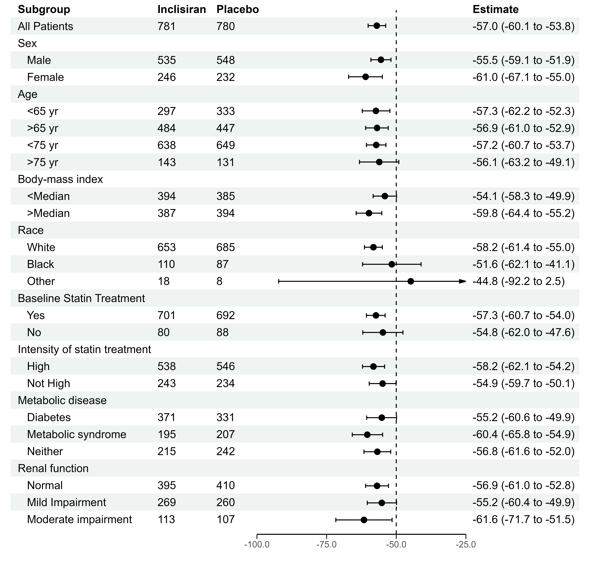
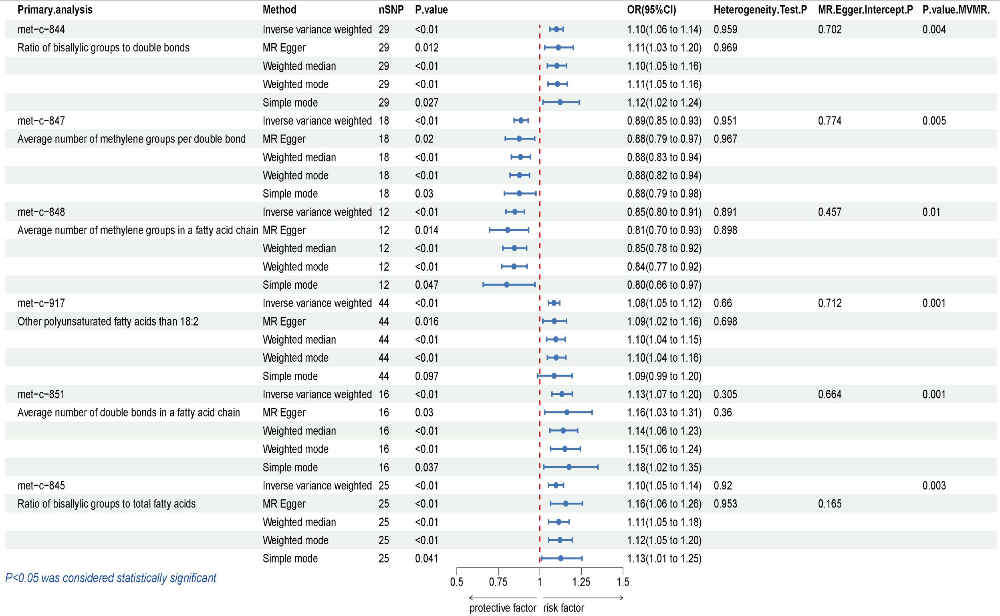
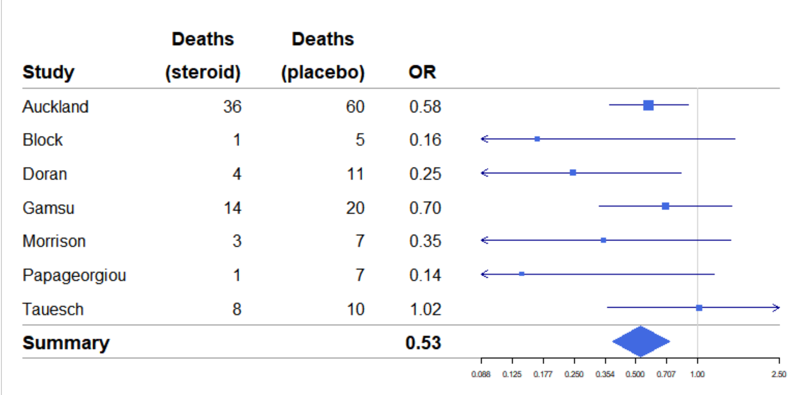
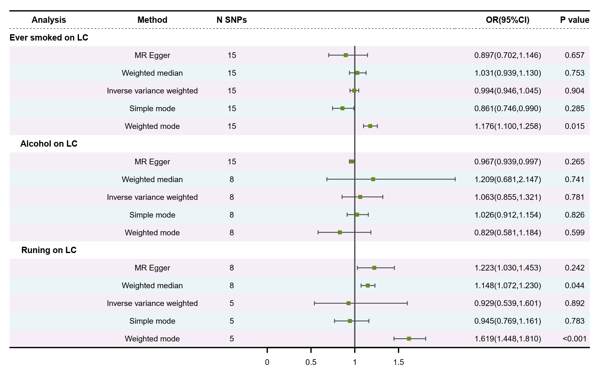
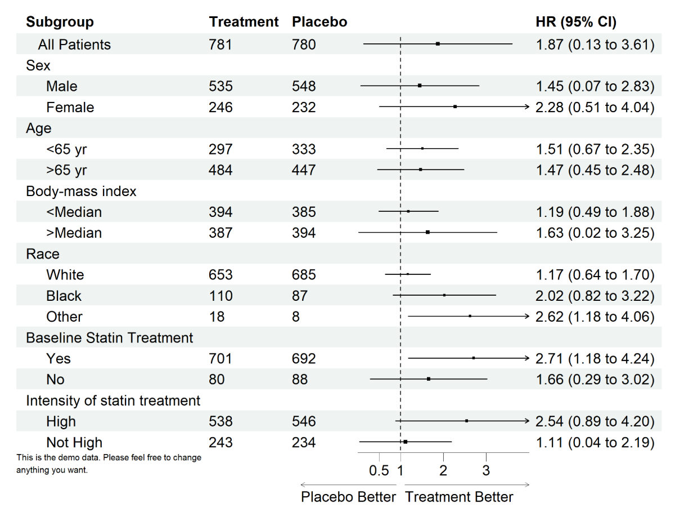

## 引言

森林图（**Forest plot**）是生物医学、流行病学和统计学研究中常用的可视化工具，主要用于展示多变量回归分析（如OR/HR及其置信区间）或Meta分析的结果。一个清晰、美观的森林图不仅有助于直观呈现数据结论，也是论文和报告中重要的图表类型。

R语言中已经有不少用于绘制森林图的工具包，但实际使用中，许多默认样式并不能完全满足论文发表或正式汇报对美观性和信息表达的需求。因此，如何高效地绘制格式规范、内容充实、风格美观的森林图，成为科研工作者和数据分析人员常常遇到的问题。

本篇文章将简要梳理R中常用的森林图绘制方法，比较不同工具包的优缺点，并以`forestploter`为例，介绍如何从基础用法到进一步定制，实现更高质量的图形展示。最后，也会分享一份便于复用的自定义绘图函数，以期为有类似需求的同仁提供一些参考。

---

## 1. 森林图的原理与R语言常规实现

### 什么是森林图？

森林图（**Forest plot**）是一种用于展示多个变量效应量及其置信区间的统计图表。最早广泛应用于Meta分析，近年来在多变量回归、组间比较等医学和生物统计分析中也成为常见的可视化方式。

通过森林图，可以**直观地比较不同变量或亚组的效应大小**，同时展示估计值的不确定性。这类图表有助于揭示哪些因素具有统计学意义或实际意义。

### 主要应用场景

- **回归分析**（如Logistic回归、Cox回归等）：用于展示各变量的OR、HR等及其95%置信区间。
- **Meta分析**：用于合并多个研究结果，直观显示各研究及总体效应。
- **组间比较/亚组分析**：快速比较不同组别下指标的影响。

### 森林图的基本结构

一张标准的森林图通常包含如下元素：

- **变量名（Variables）**：如性别、年龄、吸烟等
- **点估计值（Estimate / OR / HR）**：每个变量的效应量
- **置信区间（95% CI）**：评估估计值的可信范围
- **p值/显著性标注（P value）**：用于区分统计显著与否
- **参考线（Reference line）**：一般为OR=1或HR=1，作为无效应参考

这种结构使森林图能够兼顾信息量和可读性，成为医学和生信论文中极为常用的统计图表之一。





---

## 2. R语言画森林图的主流工具

R有多种绘制森林图的包，最常用的包括：

- [`forestplot`](https://cran.r-project.org/web/packages/forestplot/index.html) —— 经典、简单表格式展示。
    
    
    
    通过自定义参数设置，也可以绘制出更美观、个性化的图形：
    
    
    
- [`forestploter`](https://github.com/adayim/forestploter) —— 新一代美化神器，适合定制化发表级别森林图，支持自定义样式、批量修改、美观对齐等。
    
    
    
- 其他如 `ggplot2`（灵活性极高，但代码较繁琐），`meta`（专注于Meta分析，可直接绘制合并效应森林图）等，也可用于特定场景下的森林图绘制。

**本教程将重点介绍 `forestploter` 包的用法**，因为它在美观度、灵活性和扩展性方面明显优于传统方法，更适合需要高质量、可定制的科研图表。

---

## 3. 用forestploter绘制基础森林图

### 安装与加载

```r
# 安装（首次使用）
install.packages("forestploter")

# 也可以通过github安装最新版本
# install.packages("devtools")
# devtools::install_github("adayim/forestploter")

# 加载包
library(forestploter)
library(dplyr)
```

### 准备数据

准备一个数据框（data.frame），包含绘图所需的主要字段：

- `variable`：变量名
- `estimate`：点估计（如 OR、HR）
- `conf.low`：置信区间下界
- `conf.high`：置信区间上界
- `p.value`：P 值

```r
data <- data.frame(
  variable = c(
    "Age (≥60)", "Sex (Male)", "BMI (High)",
    "Treatment A", "Treatment B", "Smoking",
    "Comorbidity", "Hypertension", "Diabetes",
    "CRP (Elevated)", "LDL-C (High)", "Physical Activity (Low)"
  ),
  estimate = c(
    1.42, 0.88, 1.20,
    0.75, 1.65, 1.05,
    1.35, 1.28, 0.97,
    1.58, 1.44, 0.72
  ),
  conf.low = c(
    1.10, 0.68, 0.95,
    0.56, 1.22, 0.82,
    1.01, 1.01, 0.72,
    1.20, 1.10, 0.54
  ),
  conf.high = c(
    1.83, 1.13, 1.52,
    1.00, 2.23, 1.35,
    1.80, 1.63, 1.31,
    2.08, 1.90, 0.96
  ),
  p.value = c(
    0.005, 0.270, 0.090,
    0.045, 0.003, 0.600,
    0.040, 0.038, 0.780,
    0.004, 0.015, 0.030
  )
)

# 合并 estimate, conf.low, conf.high 为一列字符串（保留三位小数可自定义）
data <- data %>%
  mutate(
    `OR (95% CI)` = sprintf("%.3f (%.3f to %.3f)", estimate, conf.low, conf.high)
  )

# 用 mutate() 添加一个空白列，方便森林图美观排版
gap_width <- 30  # 空白宽度（空格数），可根据实际调整
data <- data %>%
  mutate(
    " " = paste(rep(" ", gap_width), collapse = "")  # 生成一个仅包含空格的列
  )
```

### 最小可运行代码（Hello Forest Plot）

```r
# 基础森林图
p <- forest(
  data[, c(1, 5, 7, 6)],   # 传入所需列的位置或名称，自定义顺序
  est = data$estimate,
  lower = data$conf.low,
  upper = data$conf.high,
  ci_column = 3,  # 空白列的位置，这里共传入4列，空白列在第3列
  ref_line = 1,  # 参考线位置，通常0或1 
  arrow_lab = c("Unfavorable Factor", "Favorable Factor"),
  xlim = c(0, 2),
  ticks_at = c(0, 0.5, 1, 1.5, 2),
  footnote = "P-value < 0.05 was considered statistically significant"
)
# 打印/显示图形
plot(p)
```

这样就能画出一张最基础的森林图。如果你追求更美观和实用，还可以自定义配色、标签、显著性等，后面会详细讲解。

---

## 4. 进阶美化与批量处理

### 自定义主题

森林图的“美观度”很大程度上取决于主题（`forest_theme()`），可以通过主题参数快速定制**点线样式、字体、颜色、底色**等，满足不同杂志或会议风格需求。

```r
library(forestploter)
library(dplyr)
library(grid)  # 用于gpar设置字体、线型等

# 自定义主题
tm <- forest_theme(
  base_size = 18,              # 全局基础字号（包括变量名等表格文本）
  ci_pch = 16,                 # 置信区间点的形状（16=实心圆）
  ci_lty = 1,                  # 置信区间线型（1=实线）
  ci_lwd = 1.5,                # 置信区间线宽
  ci_col = "black",            # 置信区间线颜色
  ci_alpha = 0.8,              # 置信区间透明度
  ci_fill = "#E64B35",         # 置信区间“方块”的填充色
  ci_Theight = 0.2,            # 方块高度（视觉效果，0.1~0.3适中）
  refline_gp = gpar(lwd = 1, lty = "dashed", col = "grey20"),  # 参考线（虚线）样式
  base_family = "sans",        # 全局字体
  xaxis_gp = gpar(fontsize = 12, fontfamily = "sans"),         # x轴字体
  footnote_gp = gpar(cex = 0.6, fontface = "italic", col = "blue") # 脚注样式（小号、蓝色斜体）
)

# 绘制森林图，应用自定义主题
p <- forest(
  data[, c(1, 5, 7, 6)],   # 传入所需列的位置或名称，自定义顺序
  est = data$estimate,
  lower = data$conf.low,
  upper = data$conf.high,
  ci_column = 3,  # 空白列的位置，这里共传入4列，空白列在第3列
  ref_line = 1,  # 参考线位置，通常0或1 
  arrow_lab = c("Unfavorable Factor", "Favorable Factor"),
  xlim = c(0, 2),
  ticks_at = c(0, 0.5, 1, 1.5, 2),
  footnote = "P-value < 0.05 was considered statistically significant",
  theme = tm  # 应用自定义主题
)
# 打印/显示图形
plot(p)
```

### 自定义箱体颜色与显著性高亮

在实际科研/投稿场景中，除了整体主题美化，我们常希望**不同变量分组使用不同颜色的CI箱体**（比如区分人群/风险方向），以及对显著性变量（如P < 0.05）**自动加粗或突出显示**，让结果一目了然。

`forestploter` 的最大优势之一就是支持**批量自定义每一行的箱体颜色和显著性自动高亮**。实现思路如下：

- **箱体颜色**：你可以提前设置一个颜色向量（如分组配色、渐变、强调某些变量），然后用 `edit_plot()` 逐行修改每一行CI箱体的颜色，轻松实现“多彩森林图”。
- **显著性高亮**：自动检测P值，显著性变量（如 P < 0.05）自动加粗对应的表格内容（比如“p.value”那一列），高效且直观。

### 使用场景举例

- **分层变量对比**：比如男性/女性、暴露组/对照组，各自用不同箱体色，更直观区分分组。
- **多因子联动展示**：强调高风险/低风险变量或亚组，结果展示更清晰。
- **投稿/报告美观度提升**：显著性一目了然，杂志级别可视化。

### 实现方法与代码示例

设置好你需要的**箱体颜色**和**显著性阈值**后，只需几行代码即可自动实现批量美化（可与上一节主题代码无缝衔接）：

```r
# 这里 p 为前面的森林图对象，赋值给fp对象后继续，以作区分
fp <- p

# boxcolor：为每一行CI箱体指定颜色，可用分组或渐变
boxcolor <- c("#E64B35", "#4DBBD5", "#00A087", "#3C5488", "#F39B7F", "#8491B4", "#91D1C2", "#DC0000", "#7E6148")

# 自动扩展颜色到每一行
boxcolor <- rep(boxcolor, length.out = nrow(data)) # 也可以两种、三种颜色交替等

# bold_sig、sig_level：是否加粗显著性变量，和阈值
bold_sig <- TRUE
sig_level <- 0.05

for (i in seq_len(nrow(data))) {
  # 分别为每一行的置信区间箱体指定颜色
  fp <- edit_plot(fp, col = 3, row = i, which = "ci", gp = gpar(fill = boxcolor[i]))
  # 对显著性变量自动加粗
  if (bold_sig && !is.na(data$p.value[i]) && data$p.value[i] < sig_level) {
    fp <- edit_plot(fp, col = 2, row = i, which = "text", gp = gpar(fontface = "bold"))
  }
}

# 展示美化后的森林图
plot(fp)

```

### 温馨提示

- 只要提前定义好颜色向量和显著性逻辑，即可**灵活批量美化**森林图，不必手动调整每一行。
- 如果想同时加粗并变色，可设定 `gpar(fontface = "bold", col = "red")` 等复合样式。
- 你也可以进一步扩展，比如根据其他变量分组动态着色，或为高风险组用深色强调。

### 表格列对齐美化（进阶）

在美化森林图表格时，不同信息列常有不同的最佳对齐方式：

- 变量名/描述（如 variable）**左对齐**更自然，便于浏览。
- p值、数值结果等通常**右对齐**，方便比对数字位数。

`forestploter` 提供了灵活的 `edit_plot()` 功能，可以**逐列设置对齐方式**，让整个表格观感与SCI期刊、医学报告一致。

### 对齐实现思路

1. **先设定每一类列的对齐目标**（左、中、右）。
2. 用 `edit_plot()` 对 body（内容）和 header（表头）分别调整对齐参数。
3. 批量自动处理所有相关列，保证效率和一致性。

### 实现代码（带详细中文注释）

```r
# 设定各类对齐列号（示例：左对齐第1列，居中第2列，右对齐剩余列）

align_left   <- 1               
align_center <- 2
align_right  <- c(3:4)

# 左对齐
for (col in align_left) {
  fp <- edit_plot(fp, col = col, which = "text", part = "body",
                  hjust = unit(0, "npc"), x = unit(0, "npc"))
  fp <- edit_plot(fp, col = col, which = "text", part = "header",
                  hjust = unit(0, "npc"), x = unit(0, "npc"))
}
# # 居中对齐
for (col in align_center) {
  fp <- edit_plot(fp, col = col, which = "text", part = "body",
                  hjust = unit(0.5, "npc"), x = unit(0.5, "npc"))
  fp <- edit_plot(fp, col = col, which = "text", part = "header",
                  hjust = unit(0.5, "npc"), x = unit(0.5, "npc"))
}
# 右对齐
for (col in align_right) {
  fp <- edit_plot(fp, col = col, which = "text", part = "body",
                  hjust = unit(1, "npc"), x = unit(1, "npc"))
  fp <- edit_plot(fp, col = col, which = "text", part = "header",
                  hjust = unit(1, "npc"), x = unit(1, "npc"))
}

# 展示美化后的森林图
plot(fp)
```

### 场景说明

- 如果你的表格结构不同（比如只展示2列），可根据实际调整`align_left`、`align_center`、`align_right`的列号。
- 这种批量调整方式适合任何自定义格式的森林图，能让“混合型表格”完美对齐，无需一列一列手动调。

### 使用 ggsave() 导出森林图（适用于 ggplot2 对象）

`ggsave()` 是 `ggplot2` 的专用导出函数，支持多种图片格式。
典型写法如下：

```r
library(ggplot2)

# 导出为高分辨率 TIFF
ggsave(filename = "forest_table6.11.tiff", plot = fp,
       width = 25, height = 20, units = "cm", dpi = 300)

# 导出为 JPEG
ggsave(filename = "forest_table6.5.jpg", plot = fp,
       width = 20, height = 8, units = "cm", dpi = 300)

# 也可以灵活指定格式、宽高、分辨率
ggsave(filename = "forest_table6.4.tiff", plot = fp,
       width = 25, height = 15, units = "cm", dpi = 300)
```

- **filename**（或`file`）指定保存文件名和格式
- **plot** 指定要保存的 ggplot2 对象
- **width/height/units** 控制图片物理尺寸（建议单位用 `"cm"` 便于期刊/幻灯片排版）
- **dpi** 决定分辨率，300适合论文，600适合医学核心或细节要求高的场合

---

## 5. 一键式发表级森林图函数：`plot_forest()` （evanverse 包）

这一节介绍个人 R 包 **evanverse**（GitHub：[@evanbio](https://github.com/evanbio)）中集成的森林图整合函数 `plot_forest()`。

该函数充分吸收了前文所有美化、批量处理和自动对齐经验，面向实际科研与数据分析需求设计，**一行代码即可生成美观、可定制的出版级森林图**。

### 核心特点

- 支持**自动检测数据列名**，灵活兼容各种结果表结构
- 内置**高美观主题、分组配色、显著性高亮与对齐**，开箱即用
- 可自定义每一项参数，兼容复杂批量绘图/流程脚本

### 参数说明（完整注释，包文档标准）

```r
#' 绘制发表级森林图（evanverse包，集成批量配色/对齐/显著性美化）
#'
#' @param data 数据框，需包含效应量、置信区间、变量名和p值列
#' @param estimate_col 效应量列名（如"estimate"/"or"/"hr"等）
#' @param lower_col 下置信区间列名
#' @param upper_col 上置信区间列名
#' @param label_col 变量名列名
#' @param p_col p值列名
#' @param ref_line 参考线（如OR/HR的1，差值的0）
#' @param sig_level 显著性判定阈值（默认0.05）
#' @param bold_sig 是否高亮加粗显著性行
#' @param arrow_lab X轴两端标签
#' @param ticks_at X轴刻度
#' @param footnote 图下脚注
#' @param boxcolor CI箱体颜色
#' @param align_left 左对齐列号
#' @param align_right 右对齐列号
#' @param align_center 居中对齐列号
#' @param gap_width 空白间隔宽度（默认30）
#'
#' @return forestploter 对象，可直接plot导出
#' @author evanbio (https://github.com/evanbio)
#' @export

```

> 🚩完整函数源码已收录于 evanverse R 包，欢迎 star 交流或 PR。
> 

### 典型用法（最小例子）

```r
library(evanverse)    # devtools::install_github("evanbio/evanverse")
# 或直接粘贴函数源码到自己的分析脚本

data <- data.frame(
  variable = c(
    "Age (≥60)", "Sex (Male)", "BMI (High)",
    "Treatment A", "Treatment B", "Smoking",
    "Comorbidity", "Hypertension", "Diabetes",
    "CRP (Elevated)", "LDL-C (High)", "Physical Activity (Low)"
  ),
  estimate = c(
    1.42, 0.88, 1.20,
    0.75, 1.65, 1.05,
    1.35, 1.28, 0.97,
    1.58, 1.44, 0.72
  ),
  conf.low = c(
    1.10, 0.68, 0.95,
    0.56, 1.22, 0.82,
    1.01, 1.01, 0.72,
    1.20, 1.10, 0.54
  ),
  conf.high = c(
    1.83, 1.13, 1.52,
    1.00, 2.23, 1.35,
    1.80, 1.63, 1.31,
    2.08, 1.90, 0.96
  ),
  p.value = c(
    0.005, 0.270, 0.090,
    0.045, 0.003, 0.600,
    0.040, 0.038, 0.780,
    0.004, 0.015, 0.030
  )
)

# 合并 estimate, conf.low, conf.high 为一列字符串（保留三位小数可自定义）
data <- data %>%
  mutate(
    `OR (95% CI)` = sprintf("%.3f (%.3f to %.3f)", estimate, conf.low, conf.high)
  )

# 用 mutate() 添加一个空白列，方便森林图美观排版
gap_width <- 30  # 空白宽度（空格数），可根据实际调整
data <- data %>%
  mutate(
    " " = paste(rep(" ", gap_width), collapse = "")  # 生成一个仅包含空格的列
  )
 
 # 调用evanverse中的plot_forest函数
 fp <- plot_forest(
  data = data,
  estimate_col = "estimate",
  lower_col = "conf.low",
  upper_col = "conf.high",
  label_col = "variable",
  p_col = "p.value"
) 

plot(fp)
```

补充说明

- **如果你的列名就是默认值（如上），可省略后面这些参数**，直接 `plot_forest(data)` 也行，但建议总是“写明每一列”更稳健。
- **如果列名不同**（比如 `or`, `lci`, `uci`, `p`），你就要这样写：
    
    ```r
    fp <- plot_forest(
      data = data,
      estimate_col = "or",
      lower_col = "lci",
      upper_col = "uci",
      label_col = "term",
      p_col = "p"
    )
    ```
    

## 总结

- **森林图**是医学和生信统计分析中不可或缺的可视化工具，适用于回归、分组、Meta分析等多场景。
- R语言的 [`forestploter`](https://github.com/adayim/forestploter) 包支持美观且高度定制的森林图输出。
- 通过前文介绍，从数据整理、主题美化到批量出图与个性化定制，你可以轻松实现**论文级、发表级的森林图可视化**，显著提升结果呈现的专业性。

---

### 相关阅读/扩展

- [forestploter官方文档](https://github.com/adayim/forestploter)
- [evanverse R 包（Github，持续维护中）](https://github.com/evanbio/evanverse)
