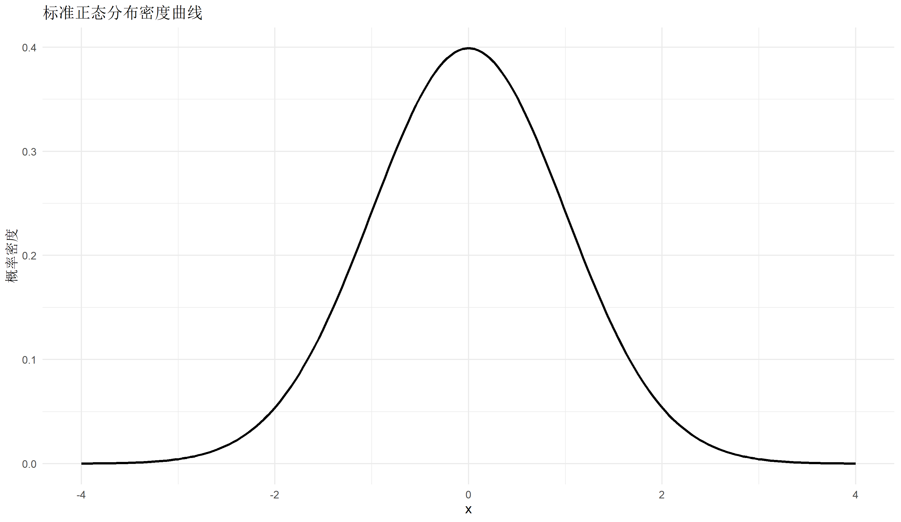
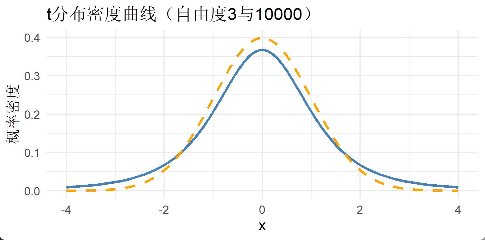
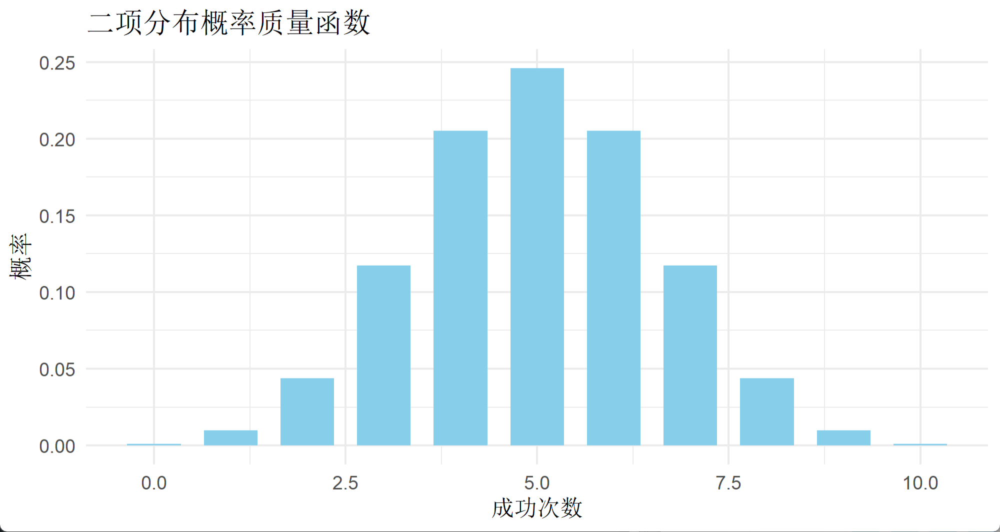
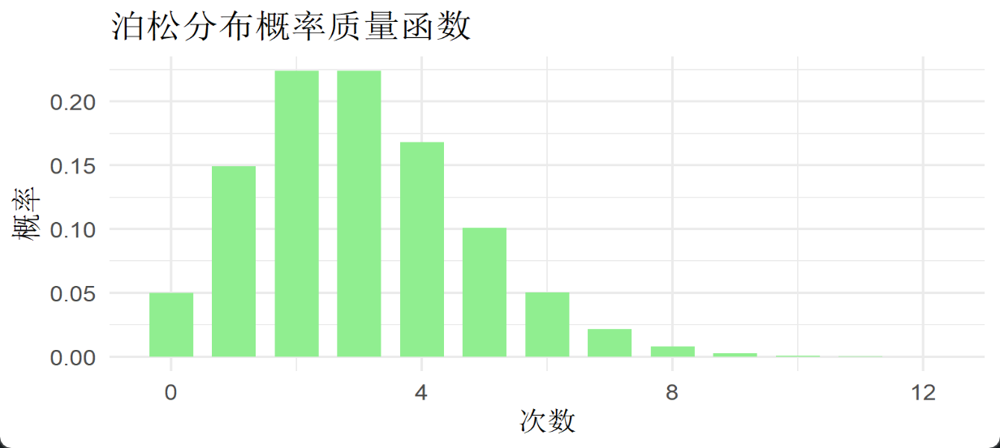
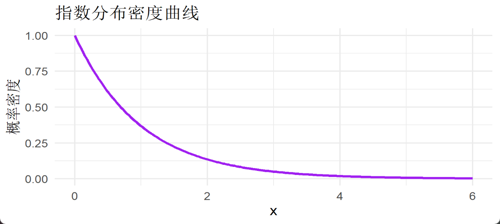
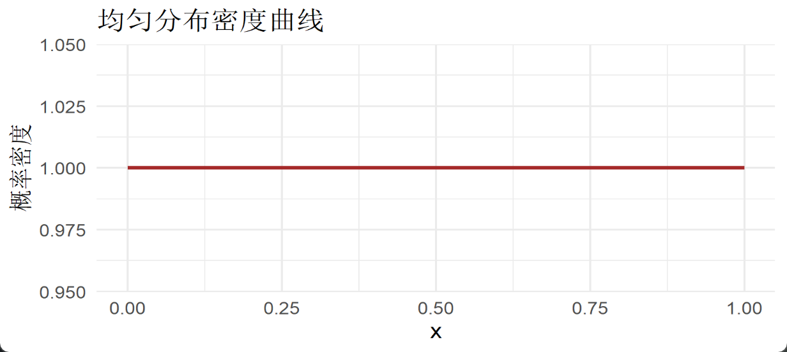
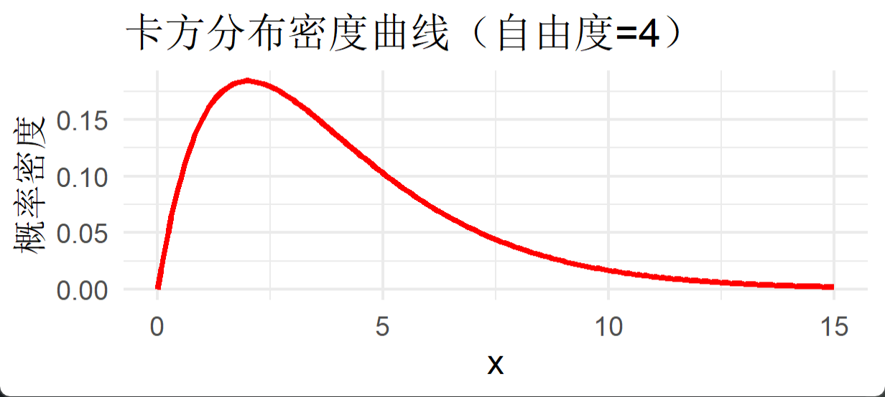
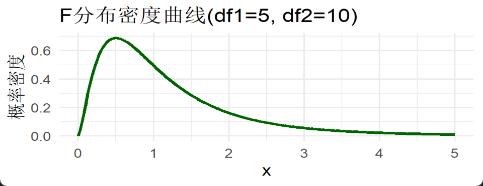

统计学分布是数据分析的基础。本文介绍R语言中最常用的统计分布，并用概率密度/概率质量图直观展示其特征，帮助大家理解分布形状及其典型应用。

---

## 1. 正态分布（Normal Distribution）

**定义：**

连续、对称分布，由均值 μ 和标准差σ控制。又称高斯分布，许多自然和社会现象都服从正态分布。

**R代码：绘制标准正态分布密度曲线**

```r
library(ggplot2)
x <- seq(-4, 4, length.out = 200)
df <- data.frame(
  x = x,
  y = dnorm(x, mean = 0, sd = 1)
)
ggplot(df, aes(x, y)) +
  geom_line(size = 1.2) +
  labs(title = "标准正态分布密度曲线", x = "x", y = "概率密度") +
  theme_minimal(base_size = 14)

```



**R代码：生成正态分布模拟数据**

R中用rnorm()生成正态分布随机数。常用参数为样本量n，均值mean，标准差sd

```r
set.seed(123)  # 保证结果可复现
sim_data <- rnorm(n = 1000, mean = 0, sd = 1)  # 生成1000个标准正态分布样本
head(sim_data)
# [1] -0.56047565 -0.23017749  1.55870831  0.07050839  0.12928774  1.71506499

# 可视化：直方图与理论密度曲线对比
library(ggplot2)
ggplot(data.frame(value = sim_data), aes(x = value)) +
  geom_histogram(aes(y = ..density..), bins = 30, fill = "skyblue", color = "white", alpha = 0.7) +
  stat_function(fun = dnorm, args = list(mean = 0, sd = 1), color = "red", size = 1.2) +
  labs(title = "正态分布模拟数据直方图与理论密度", x = "x", y = "密度") +
  theme_minimal(base_size = 14)

```

### **应用场景：**

身高、体重、考试分数、测量误差等。

---

## 2. t分布（Student’s t Distribution）

**定义：**

t分布是一类对称的连续概率分布，由**自由度** df（通常为样本量减1）控制形状。自由度小，分布两尾更厚（更容易出现极端值）；自由度增大，t分布逐渐趋近于标准正态分布。常用于小样本下均值的统计推断。

**R代码：绘制不同自由度的t分布密度曲线**

```r
library(ggplot2)
x <- seq(-4, 4, length.out = 200)
df_t <- data.frame(
  x = x,
  df5 = dt(x, df = 3),
  df20 = dt(x, df = 10000)
)
ggplot(df_t) +
  geom_line(aes(x, df5), color = "steelblue", size = 1.2, linetype = "solid") +
  geom_line(aes(x, df20), color = "orange", size = 1.2, linetype = "dashed") +
  labs(title = "t分布密度曲线（自由度3与10000）", x = "x", y = "概率密度") +
  theme_minimal(base_size = 14)

```



R代码：生成t分布模拟数据

t分布数据可以用 `rt()` 生成。参数包括样本量 `n` 和自由度 `df`：

```r
set.seed(42)
sim_t <- rt(n = 1000, df = 5)  # 生成1000个自由度为5的t分布样本
head(sim_t)
# [1] -0.85632894 -0.45391286  2.01890836  0.85583582  0.37203661 -0.58977411

# 可视化：直方图与理论密度曲线对比
ggplot(data.frame(value = sim_t), aes(x = value)) +
  geom_histogram(aes(y = ..density..), bins = 30, fill = "skyblue", color = "white", alpha = 0.7) +
  stat_function(fun = dt, args = list(df = 5), color = "steelblue", size = 1.2) +
  labs(title = "t分布模拟数据直方图与理论密度", x = "x", y = "密度") +
  theme_minimal(base_size = 14)

```

### **常用R函数**

- **概率密度函数**：`dt(x, df)`
- **分布函数**：`pt(x, df)`
- **分位点函数**：`qt(p, df)`
- **随机数生成**：`rt(n, df)`

**应用场景：**

小样本均值检验（t检验）。

---

## 3. 二项分布（Binomial Distribution）

**定义：**

二项分布是一种离散型概率分布，描述n次独立重复试验中，事件成功k次的概率。每次试验的成功概率为p，且各次试验相互独立。

**R代码：绘制二项分布概率质量函数（PMF）**

```r
library(ggplot2)
n <- 10; p <- 0.5
k <- 0:n
df_binom <- data.frame(
  k = k,
  prob = dbinom(k, size = n, prob = p)
)
ggplot(df_binom, aes(k, prob)) +
  geom_bar(stat = "identity", fill = "skyblue", width = 0.7) +
  labs(title = "二项分布概率质量函数", x = "成功次数", y = "概率") +
  theme_minimal(base_size = 14)

```



R代码：生成二项分布模拟数据

使用 `rbinom()` 可以模拟$n$次试验下多组观测数据。

```r
set.seed(2024)
sim_binom <- rbinom(n = 1000, size = n, prob = p)  # 生成1000个样本，每样本为10次实验的成功次数
head(sim_binom)
# [1] 5 5 6 4 7 5

# 可视化：直方图展示模拟数据分布
ggplot(data.frame(success = sim_binom), aes(x = success)) +
  geom_bar(fill = "orange", color = "white", width = 0.7) +
  labs(title = "二项分布模拟数据直方图", x = "成功次数", y = "频数") +
  theme_minimal(base_size = 14)

```

### **常用R函数**

- **概率质量函数**：`dbinom(k, size, prob)`
- **分布函数（累计概率）**：`pbinom(k, size, prob)`
- **分位点函数**：`qbinom(p, size, prob)`
- **随机数生成**：`rbinom(n, size, prob)`

**应用场景：**

抛硬币、抽签、批量检验合格品数量。

---

## 4. 泊松分布（Poisson Distribution）

**定义：**

泊松分布是一种离散概率分布，描述在单位时间/空间内某事件发生的次数。由参数 λ 控制，λ 表示单位内的平均发生次数。常用于分析稀有事件出现的概率。

R代码：绘制泊松分布概率质量函数（PMF）

```r
library(ggplot2)
lambda <- 3
k <- 0:12
df_pois <- data.frame(
  k = k,
  prob = dpois(k, lambda = lambda)
)
ggplot(df_pois, aes(k, prob)) +
  geom_bar(stat = "identity", fill = "lightgreen", width = 0.7) +
  labs(title = "泊松分布概率质量函数", x = "次数", y = "概率") +
  theme_minimal(base_size = 14)

```



### **R代码：生成泊松分布模拟数据**

使用 `rpois()` 可生成模拟数据，适合分析实际观测事件次数的分布。

```r
set.seed(2024)
sim_pois <- rpois(n = 1000, lambda = lambda)  # 生成1000个样本
head(sim_pois)
# [1] 1 1 3 3 2 1

# 可视化：模拟数据的直方图
ggplot(data.frame(count = sim_pois), aes(x = count)) +
  geom_bar(fill = "lightblue", color = "white", width = 0.7) +
  labs(title = "泊松分布模拟数据直方图", x = "事件发生次数", y = "频数") +
  theme_minimal(base_size = 14)

```

### **常用R函数**

- **概率质量函数**：`dpois(k, lambda)`
- **分布函数（累计概率）**：`ppois(k, lambda)`
- **分位点函数**：`qpois(p, lambda)`
- **随机数生成**：`rpois(n, lambda)`

**应用场景：**

一分钟内顾客到达数、一天事故数。

---

## 5. 指数分布（Exponential Distribution）

**定义：**

指数分布是描述**连续事件间隔时间**的概率分布，常见于寿命分析和等待时间模拟。由参数 λ（事件发生率，或 `rate`）控制，λ 越大，事件越容易发生。

**R代码：绘制指数分布概率密度曲线**

```r
library(ggplot2)
x_exp <- seq(0, 6, length.out = 200)
df_exp <- data.frame(
  x = x_exp,
  y = dexp(x_exp, rate = 1)
)
ggplot(df_exp, aes(x, y)) +
  geom_line(size = 1.2, color = "purple") +
  labs(title = "指数分布密度曲线", x = "x", y = "概率密度") +
  theme_minimal(base_size = 14)

```



### **R代码：生成指数分布模拟数据**

用 `rexp()` 生成一组指数分布的模拟样本，适合寿命或等待时间数据建模。

```r
set.seed(2024)
sim_exp <- rexp(n = 1000, rate = 1)  # 生成1000个样本，λ=1
head(sim_exp)
# [1] 0.12723686 0.25898587 0.00361132 0.10504584 0.40902923 0.16941225

# 可视化：模拟数据的直方图
ggplot(data.frame(interval = sim_exp), aes(x = interval)) +
  geom_histogram(aes(y = ..density..), bins = 30, fill = "plum", color = "white", alpha = 0.7) +
  stat_function(fun = dexp, args = list(rate = 1), color = "purple", size = 1.2) +
  labs(title = "指数分布模拟数据直方图与理论密度", x = "事件间隔", y = "密度") +
  theme_minimal(base_size = 14)

```

### **常用R函数**

- **概率密度函数**：`dexp(x, rate)`
- **分布函数（累计概率）**：`pexp(x, rate)`
- **分位点函数**：`qexp(p, rate)`
- **随机数生成**：`rexp(n, rate)`

**应用场景：**

零件寿命、电话呼入时间间隔。

---

## 6. 均匀分布（Uniform Distribution）

**定义：**

均匀分布（Uniform distribution）是最简单的连续分布。在区间 [a, b] 内每个值出现的概率完全相同，常用于模拟随机噪声或随机抽样。

R代码：绘制均匀分布概率密度曲线

```r
x_unif <- seq(0, 1, length.out = 200)
df_unif <- data.frame(
  x = x_unif,
  y = dunif(x_unif, min = 0, max = 1)
)
ggplot(df_unif, aes(x, y)) +
  geom_line(size = 1.2, color = "brown") +
  labs(title = "均匀分布密度曲线", x = "x", y = "概率密度") +
  theme_minimal(base_size = 14)

```



### **R代码：生成均匀分布模拟数据**

使用 `runif()` 生成指定区间内的均匀分布随机样本。

```r
set.seed(2024)
sim_unif <- runif(n = 1000, min = 0, max = 1)  # 生成1000个[0,1]之间的均匀分布样本
head(sim_unif)
# [1] 0.3872789 0.6474115 0.2776499 0.3653614 0.0115632 0.5536871

# 可视化：直方图展示模拟数据
ggplot(data.frame(value = sim_unif), aes(x = value)) +
  geom_histogram(aes(y = ..density..), bins = 30, fill = "tan", color = "white", alpha = 0.7) +
  stat_function(fun = dunif, args = list(min = 0, max = 1), color = "brown", size = 1.2) +
  labs(title = "均匀分布模拟数据直方图与理论密度", x = "值", y = "密度") +
  theme_minimal(base_size = 14)

```

### **常用R函数**

- **概率密度函数**：`dunif(x, min, max)`
- **分布函数（累计概率）**：`punif(x, min, max)`
- **分位点函数**：`qunif(p, min, max)`
- **随机数生成**：`runif(n, min, max)`

**应用场景：**

随机采样、模拟均匀噪声。

---

## 7. 卡方分布（Chi-square Distribution）

**定义：**

卡方分布是正态分布样本方差的概率分布，常用来检验方差、独立性及分布拟合优度。其形状由自由度（df）决定，自由度越大，分布越接近正态。

R代码：绘制卡方分布概率密度曲线

```r
library(ggplot2)
x_chi <- seq(0, 15, length.out = 200)
df_chi <- data.frame(
  x = x_chi,
  y = dchisq(x_chi, df = 4)
)
ggplot(df_chi, aes(x, y)) +
  geom_line(size = 1.2, color = "red") +
  labs(title = "卡方分布密度曲线（自由度=4）", x = "x", y = "概率密度") +
  theme_minimal(base_size = 14)

```



### **R代码：生成卡方分布模拟数据**

用 `rchisq()` 生成模拟的卡方分布样本，适合检验理论与实际分布的关系。

```r
set.seed(2024)
sim_chi <- rchisq(n = 1000, df = 4)  # 生成1000个自由度为4的卡方分布样本
head(sim_chi)
# [1]  6.998011  7.125418  5.464276  2.635646  7.353873  2.057859

# 可视化：直方图与理论密度
ggplot(data.frame(value = sim_chi), aes(x = value)) +
  geom_histogram(aes(y = ..density..), bins = 30, fill = "tomato", color = "white", alpha = 0.7) +
  stat_function(fun = dchisq, args = list(df = 4), color = "red", size = 1.2) +
  labs(title = "卡方分布模拟数据直方图与理论密度", x = "值", y = "密度") +
  theme_minimal(base_size = 14)

```

### **常用R函数**

- **概率密度函数**：`dchisq(x, df)`
- **分布函数（累计概率）**：`pchisq(x, df)`
- **分位点函数**：`qchisq(p, df)`
- **随机数生成**：`rchisq(n, df)`

**应用场景：**

方差分析、拟合优度检验。

---

## 8. F分布（Fisher’s F Distribution）

**定义：**
F分布主要用于比较两组方差之比，是方差分析（ANOVA）和回归模型对比等统计推断中的重要分布。F分布有两个自由度参数：分子自由度`df1`和分母自由度`df2`。

R代码：绘制F分布概率密度曲线

```r
library(ggplot2)
x_f <- seq(0, 5, length.out = 200)
df_f <- data.frame(
  x = x_f,
  y = df(x_f, df1 = 5, df2 = 10)
)
ggplot(df_f, aes(x, y)) +
  geom_line(size = 1.2, color = "darkgreen") +
  labs(title = "F分布密度曲线(df1=5, df2=10)", x = "x", y = "概率密度") +
  theme_minimal(base_size = 14)

```



### **R代码：生成F分布模拟数据**

用 `rf()` 生成F分布的模拟样本，可用于分析方差比的实际分布情况。

```r
set.seed(2024)
sim_f <- rf(n = 1000, df1 = 5, df2 = 10)  # 生成1000个F分布样本
head(sim_f)
# [1] 0.3574291 0.6226412 0.3479477 0.4726651 0.2282172 0.6669339

# 可视化：直方图与理论密度
ggplot(data.frame(value = sim_f), aes(x = value)) +
  geom_histogram(aes(y = ..density..), bins = 30, fill = "forestgreen", color = "white", alpha = 0.7) +
  stat_function(fun = df, args = list(df1 = 5, df2 = 10), color = "darkgreen", size = 1.2) +
  labs(title = "F分布模拟数据直方图与理论密度", x = "值", y = "密度") +
  theme_minimal(base_size = 14)

```

### **常用R函数**

- **概率密度函数**：`df(x, df1, df2)`
- **分布函数（累计概率）**：`pf(x, df1, df2)`
- **分位点函数**：`qf(p, df1, df2)`
- **随机数生成**：`rf(n, df1, df2)`

**应用场景：**

方差分析，回归模型比较。

---

## 总结对比表

| 分布 | 连续/离散 | 主要参数 | 应用场景 | R绘图函数 |
| --- | --- | --- | --- | --- |
| 正态 | 连续 | mean, sd | 计量测量，自然现象 | dnorm |
| t | 连续 | df | 小样本推断 | dt |
| 二项 | 离散 | n, p | 成功次数 | dbinom |
| 泊松 | 离散 | lambda | 稀有事件次数 | dpois |
| 指数 | 连续 | rate | 时间间隔，寿命 | dexp |
| 均匀 | 连续 | min, max | 随机采样 | dunif |
| 卡方 | 连续 | df | 方差分析，拟合优度 | dchisq |
| F | 连续 | df1, df2 | 方差分析（ANOVA） | df |
