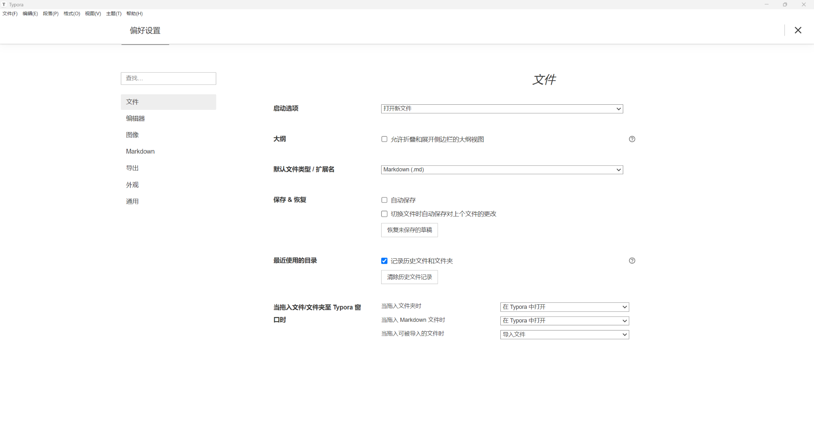
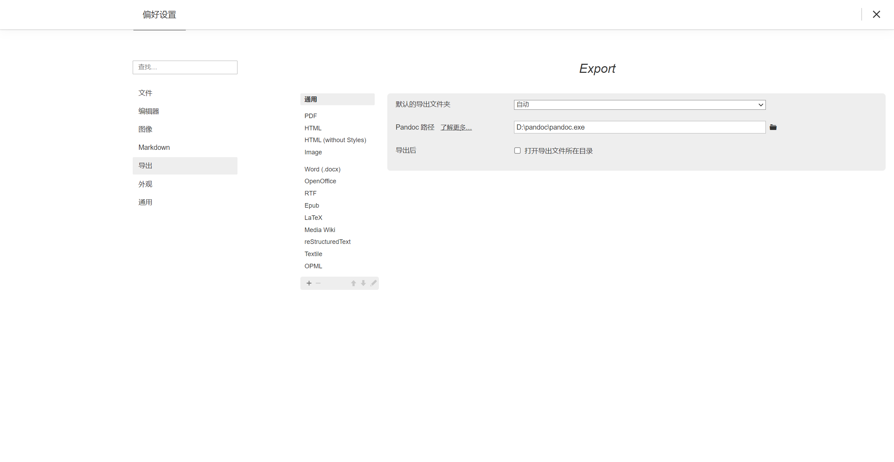

---

> Markdown 是一种让写作更轻松、更专注的轻量级标记语言，而 Typora 是写 Markdown 最舒适的编辑器之一。这篇文章将带你从零开始，快速了解 Markdown 基础，并学会使用 Typora 高效书写和整理文档。
> 

---

## ✍️ 什么是 Markdown？

Markdown 是一种纯文本格式，使用简单的标记符号来表示排版结构。它特别适合写：

- 笔记
- 博客
- 技术文档
- 论文草稿

你可以用 `#` 表示标题、用 `*` 加粗、用 ``` 包裹代码块，语法直观、易于学习，而且与各种平台兼容。

---

## 💻 推荐工具：Typora

**Typora** 是一款支持所见即所得的 Markdown 编辑器，写出来的内容长得就像最终排版效果，不需要频繁预览。

它的优势包括：

- 界面极简，写作时毫无干扰
- 支持数学公式（LaTeX）、代码高亮、表格、图片等
- 可导出 PDF、Word、HTML 等格式
- 跨平台（Windows / macOS / Linux）


---

## 🚀 安装 Typora

1. 打开官网：[https://typora.io](https://typora.io/)
2. 选择适合你操作系统的版本下载安装
3. 安装后打开即可开始写作！

Typora 现为**买断制**（一次性付费，官网约 ¥100–¥150），也可试用15天后决定是否购买。

单个激活码可供三个设备使用，

> 💡 获取方式补充
> 
> - 若希望支持正版，可直接官网购买，或在 **淘宝搜索 “Typora 激活码”**，店铺推荐数码荔枝，价格约 ¥90；
> - 若你仅用于学习参考，可临时使用**本文提供的旧版免费版或激活版本**（仅供学习用途）：
> 
> 📦 [点击下载 Typora 免费可用版本](https://pan.baidu.com/s/1DIrgRDW8qwpx18oMgCw-pw?pwd=xvqg) 提取码: xvqg
> 
> 下载并解压后，直接运行 `Typora.exe` 即可使用。
> 

---

## 🛠️ Typora 基础使用

打开 Typora 后，你可以直接开始写作，不需要提前掌握所有 Markdown 语法。你所写的内容将**实时呈现排版效果**，这就是它所见即所得的魅力。

### ✏️ 常用格式速查表

| 功能 | Markdown 写法 |
| --- | --- |
| 一级标题 | `# 标题` |
| 二级标题 | `## 标题` |
| 加粗 | `**内容**` |
| 斜体 | `*内容*` |
| 无序列表 | `- 项目1` |
| 插入图片 | `` |

> 💡 这些语法在实际写作中非常常见，无需全部记住，熟能生巧。
> 

---

### 🧭 可视化写作更友好

对于初学者来说，更推荐使用 Typora 的菜单操作快速上手：

- 点击菜单栏中的 `格式` 和 `段落` 可直接插入标题、粗体、列表等格式；
- 鼠标选中文本后，右键或使用快捷键（如 `Ctrl + B`）进行加粗/斜体；
- 也可以使用上方工具栏的小图标进行格式设置；

你甚至可以**直接复制网页内容粘贴到 Typora 中**，Typora 会自动识别格式，非常适合做读书笔记或网页摘录。

---

## ⚙️ 设置建议（入门用户推荐）

首次打开 Typora，建议进入 `文件 > 偏好设置`，按以下方式进行调整，提升使用体验：



### 📁 文件设置

- **默认文件类型**：建议选择 `Markdown (.md)`，确保与其他平台兼容；
- **自动保存**：可根据个人习惯启用；
- **记录最近使用目录**：建议勾选 ✅，便于快速访问历史文件；
- **大纲图**：可开启“允许折叠和展开相邻的大纲和图”，适合长文管理；
- **打开方式**：建议将 `.md` 文件设置为“在 Typora 中打开”，避免用系统默认程序误打开；

📷 *参考设置界面如下：*

> 💡 可点击左侧导航栏进入「图片」「导出」「外观」等子菜单做进一步优化。
> 

---

### 🖼️ 图片设置（建议开启）

进入 `图片` 设置页，建议如下配置：

- **插入图片时自动复制到指定文件夹**（如 `./images`），便于整理；
- **插入方式选择“相对路径”**，方便博客部署与同步；
- 可配合 PicGo 图床工具上传远程图片（进阶可选）；

---

### 🔤 编辑器与 Markdown 设置

- **开启自动替换语法符号**，提升输入效率；
- **在 Markdown 设置中开启自动识别任务列表 / 表格等扩展语法**；
- **插入目录**：在文中键入 `[TOC]` 即可自动生成文档目录（需插入一级/二级标题）；
- **数学公式支持**：建议开启 LaTeX 支持，输入 `$...$` 或 `$$...$$` 渲染数学表达式；

---

### 🎨 外观设置

- 推荐主题：简洁风格（如 Github / Newsprint）或暗色主题（如 Night / Pixyll）；
- 你也可以导入自定义主题（CSS 文件）进行美化（进阶用户）；

---

## 📄 导出与保存

Typora 支持将 Markdown 文档导出为多种格式，用于排版、分享或打印。

### 📤 常规导出方式

通过菜单栏：

- `文件 > 导出 > PDF`：标准输出格式，适合归档或打印；
- `文件 > 导出 > HTML / 图片`：适用于网页嵌入；
- `文件 > 保存为`：建议保存为 `.md`，保持兼容性；

---

### 📝 如何导出为 Word（.docx）？

Typora 本身不直接支持 `.docx`，但可通过配置 **Pandoc** 实现。

### ✅ 步骤如下：

1. 前往 Pandoc 官网下载并安装：https://pandoc.org/installing.html
2. 在 Typora 中打开：
    - `文件 > 偏好设置 > 导出 > Pandoc 路径`
    - 指定 Pandoc 可执行文件路径（例如：`D:\pandoc\pandoc.exe`）

📷 如图所示：



回到 `文件 > 导出` 菜单，选择 **Word (.docx)** 即可导出！

> 💡 首次使用建议先测试简单文档格式是否正常，如果出错可检查 Pandoc 是否正确安装。
> 

---

## ✅ 推荐使用场景

- 📚 学术笔记与读书摘要
- ✍️ 博客文章初稿撰写
- 📑 论文方法与结果整理
- 💡 项目文档或代码说明书

---

## 📌 总结

Markdown 是一种简单却强大的写作语言，而 Typora 是写 Markdown 的理想工具。它让写作变得轻松、专注而高效。如果你想提升写作体验，不妨就从 Typora 开始。
