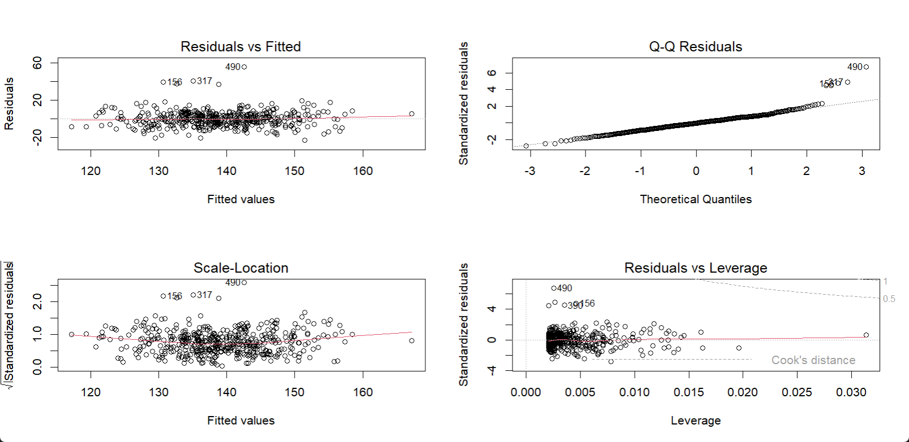

## 1. 从回归模型出发

**目标**

通过建立数学模型，刻画**自变量 X**（解释变量、预测变量、特征）与**因变量 Y**（响应变量、结果变量）之间的关系，用于**描述、解释或预测**。

---

### 1.1 回归模型的核心思想

- **形式**：
    
    $$
    g(E[Y|X]) = \beta_0 + \beta_1 X_1 + \cdots + \beta_p X_p
    $$
    
    - g(⋅) 为连接函数（link function）
    - E[Y∣X] 为条件均值
    - β 系数用于衡量 X 对 Y 的影响方向和大小
- **任务**：找到一组 β 使模型对数据拟合最好，并对参数进行统计推断（置信区间、假设检验）。

---

### 1.2 常见类型

| 模型类型 | 因变量类型 | 分布假设（误差项或响应分布） | 常用链接函数 | 典型场景 |
| --- | --- | --- | --- | --- |
| **线性回归**（OLS） | 连续型 | 正态分布，方差齐性 | 恒等（identity） | 血压、体重、实验数据 |
| **Logistic 回归** | 二分类 | 二项分布 | logit | 疾病有/无，实验成功/失败 |
| **Probit 回归** | 二分类 | 二项分布 | probit | 信用违约预测 |
| **Poisson 回归** | 计数 | 泊松分布 | log | 事件次数（如住院次数） |
| **负二项回归** | 计数（过度离散） | 负二项分布 | log | 事故次数（方差>均值） |
| **Gamma 回归** | 正且偏态 | Gamma 分布 | log/inverse | 花费、反应时间 |
| **Cox 回归**（比例风险模型） | 生存时间 | 无需指定分布 | 对数风险 | 生存分析 |

---

### 1.3 单因素回归（Univariate Regression）

- **定义**：一次只放入一个自变量 X，考察其与 Y 的关系。
- **优点**：
    - 简单直观
    - 适合初筛变量
- **缺点**：
    - 忽略混杂因素，可能高估或低估效应
    - 不能直接用于因果推断（仅描述关联）
    - 在分类变量水平较多时，可能产生稀疏问题
        - 分类变量的某些水平（类别）在数据中样本量非常少，导致模型在估计该水平的系数时不稳定，标准误很大，导致回归系数估计值极端、置信区间很宽、P 值不可靠；在逻辑回归中还可能导致模型不收敛。常见**例子比如**我们研究“是否患某疾病（Y）”与“职业类型（X）”的关系，职业变量有 10 个水平，其中“宇航员”这一类只有 2 个样本且都未患病，这会让模型在这一水平上无法估计出稳定的效应值。

---

### 1.4 单因素与多因素对比

| 特点 | 单因素回归 | 多因素回归 |
| --- | --- | --- |
| 模型复杂度 | 低 | 高 |
| 混杂控制 | 无 | 可控制已测量的混杂 |
| 可解释性 | 高 | 较低（系数受其他变量调整影响） |
| 应用场景 | 初步探索、描述性分析 | 确认性分析、预测建模 |

---

## 2. 线性回归：模型、假设与诊断

### 2.1 模型形式

单因素线性回归的基本形式为：

$$
Y = \beta_0 + \beta_1 X + \varepsilon,\quad \varepsilon \sim \text{i.i.d. } N(0, \sigma^2)
$$

- $\beta_0$：截距，表示 $X=0$ 时 $Y$ 的期望值
- $\beta_1$：斜率，表示 $X$ 每增加 1 个单位，$Y$ 的平均变化量
- $\varepsilon$：误差项，表示模型无法解释的随机波动

在单因素回归中，β1 就是我们关心的主要参数。

---

### 2.2 关键假设（OLS 经典条件）

1. **线性可加性（Linearity & Additivity）**
    - 含义：在条件均值 E(Y∣X)中，X 与 Y 之间的关系是线性的（可以有截距与斜率），各解释变量效应可加。
    - 检查方法：绘制残差-拟合值图、残差-自变量图，看是否存在系统性模式。
    - 违反时的处理：加入多项式项（X^2, X^3）、样条函数（`splines` 包）、或对变量进行变换（对数、平方根等）。
2. **独立性（Independence）**
    - 含义：各观测值相互独立，误差项之间不相关。
    - 违反时的典型场景：时间序列数据（自相关）、分组/聚类数据（同组内相关）。
    - 修正：
        - 时间序列 → 加入滞后项、使用自回归模型
        - 聚类数据 → 使用混合效应模型（`lme4::lmer()`）、聚类稳健标准误（cluster-robust SE）
3. **同方差（Homoscedasticity）**
    - 含义：误差项的方差不随 X 的取值而改变
    - 违反时（异方差）：会导致系数估计仍然无偏，但**标准误估计错误**，显著性检验可能失真
    - 检查方法：残差-拟合值图（漏斗状暗示异方差）、Breusch-Pagan 检验（`lmtest::bptest`）
    - 修正：使用稳健标准误（`sandwich::vcovHC`）、变量变换（如 log Y）
4. **误差正态性（Normality of Errors）**
    - 含义：误差项 ε 服从正态分布
    - 主要作用：保证在小样本下 t 检验、F 检验的有效性；大样本下可依赖中心极限定理（CLT）
    - 检查方法：QQ 图、Shapiro-Wilk 检验
    - 修正：
        - 对 Y 做变换
        - 使用非参数方法（如分位数回归）
        - 依赖大样本近似

---

💡 **注意**

- 单因素回归中不存在**多重共线性**（因为只有一个自变量），但依然可能受异常点或高杠杆点影响。
- **高杠杆点（Leverage Points）**：X 值远离均值的观测，对回归线斜率有较大影响
- **影响点（Influential Points）**：既远离均值，又影响回归结果（可通过 Cook’s distance 检查）

---

### 2.3 诊断与修正

| 问题 | 检查方法 | 修正建议 |
| --- | --- | --- |
| 非线性关系 | 残差图、加局部回归曲线 | 多项式项、样条函数 |
| 异方差 | 残差-拟合值图、BP 检验 | 稳健 SE、变量变换 |
| 异常值 | Cook’s distance、杠杆值 | 敏感性分析（剔除后重跑） |
| 误差非正态 | QQ 图、Shapiro 检验 | 变量变换、非参数方法 |

---

## 3. 广义线性模型（GLM）：逻辑回归

在第 2 节我们讨论的**普通线性回归**（OLS），有几个关键前提：

1. 因变量 $Y$ 是**连续型**，且可以取任意实数；
2. $Y$ 与自变量 $X$ 的关系是**线性的**（在均值层面）；
3. 误差项服从**正态分布**，方差恒定。

这些假设在很多情形下是合理的，比如预测血压、体重、收入等**连续数值**。

但是——**如果我们的因变量不是连续的，而是离散的、二元的、计数的，线性回归会出现问题**。

---

### 3.1 为什么需要“广义线性模型”？

**例子 1：二分类结局**

我们想预测患者是否患病（0 = 未患病，1 = 患病）。用线性回归直接拟合会有两个麻烦：

- 预测值可能 < 0 或 > 1，违背概率含义；
- 残差的方差不再恒定，显著性检验和区间估计会失真。

**例子 2：计数型结局**

比如预测一个月的住院次数（只能是 0,1,2,... 的整数），线性回归会给出负数预测，完全不符合常识。

这时候我们需要一种**更通用的回归框架**，能处理不同类型的因变量，同时保留“线性预测”的思想——这就是**广义线性模型（Generalized Linear Model, GLM）**。

---

### 3.2 GLM 的三个核心组成部分

GLM 在普通线性回归的基础上做了两点推广，形成了**三要素结构**：

1. **随机部分（Random Component）**
    - 指定 Y 的分布类型，不再局限于正态分布。
    - GLM 允许 Y 来自**指数分布族**（Exponential Family），包括：
        - 正态分布（Normal）→ 连续数据
        - 二项分布（Binomial）→ 二分类/比例数据
        - 泊松分布（Poisson）→ 计数数据
        - Gamma 分布 → 正且偏态的连续数据
2. **系统部分（Systematic Component）**
    - 和线性回归一样，有一个**线性预测子**：
        
        $$
        \eta = \beta_0 + \beta_1 X_1 + \dots + \beta_p X_p
        $$
        
3. **链接函数（Link Function）**
    - 把因变量的**期望值** E(Y) 通过一个函数 g(⋅) 映射到线性预测子：
        
        $$
        g(E[Y]) = \eta
        $$
        
    - 不同类型的数据选择不同的链接函数，确保预测值落在合理范围：
        - 恒等函数（identity）→ 普通线性回归
        - logit → 逻辑回归（概率数据）
        - log → 泊松回归（计数数据）

---

### 3.3 从 GLM 到逻辑回归

如果 Y 是二分类（0/1），我们选：

- **分布**：二项分布（Binomial）
- **链接函数**：logit（对数几率）
- **结果**：GLM 就变成了**逻辑回归（Logistic Regression）**

逻辑回归公式：

$$
\log\frac{p}{1-p} = \beta_0 + \beta_1 X
$$

- 其中 $p = \Pr(Y=1|X)$

优点：

- 预测值 p 永远在 0–1 范围内；
- 系数指数化（exp⁡(β1)）就是**优势比 OR**，直观易解释。

---

### 3.4 小结

- 线性回归 → GLM 的一个特例（正态分布 + 恒等链接）。
- 逻辑回归 → GLM 的一个特例（二项分布 + logit 链接）。
- GLM 框架让我们能用统一的思路处理不同类型的结局变量，只要选对分布和链接函数，就能保证预测值合理、推断可靠。

---

## 4. 逻辑回归如何解释？

逻辑回归的拟合结果往往让初学者一头雾水，因为它的系数不是直接告诉你“概率变化了多少”，而是告诉你**对数几率（log odds）**的变化。我们一步步拆开来看。

---

### 4.1 系数 β₁、对数几率（log odds）和 OR

1. **对数几率的含义**
    - 几率（odds）是“事件发生概率 / 事件不发生概率”：
        
        $$
        \text{odds} = \frac{p}{1-p}
        $$
        
    - 对数几率（log odds）就是对几率取自然对数：
        
        $$
        \log(\text{odds}) = \log\frac{p}{1-p}
        $$
        
    - 它的取值范围是 (−∞,+∞)，很适合和回归的直线结合。
2. **逻辑回归系数 β₁ 表示什么**
    
    在公式
    
    $$
    \log\frac{p}{1-p} = \beta_0 + \beta_1 X
    $$
    
    中，β1 表示 **当 X 增加 1 个单位时，对数几率的变化量**。
    
    注意，这不是概率的直接变化，而是 log odds 的变化。
    
3. **从 β₁ 到 OR（优势比）**
    - 对数几率变化量转成几率变化倍数，需要做指数变换：
        
        $$
        \text{OR} = e^{\beta_1}
        $$
        
    - OR > 1：X 增加时，事件发生的几率上升
    - OR < 1：X 增加时，事件发生的几率下降
    - 例子：β₁ = 0.69 → OR = e^0.69 ≈ 2.0，表示 X 每增加 1 个单位，事件发生的几率是原来的 **2 倍**。
4. **分类变量的情况**
    - 对于分类自变量，系数和 OR 都是**相对于参考组**的比较结果。
    - 所以在报告时一定要写清楚参考组是哪一类，比如“与 A 组相比，B 组的 OR 为 1.5”。

---

### 4.2 从概率角度怎么解释？

直接用 β₁ 或 OR 来解释概率变化不直观，因为概率变化的大小取决于原本的概率水平。

两种更直观的做法是：

1. **边际效应（Marginal Effects）**
    - 平均边际效应（AME）：平均每个观测值的概率变化，然后取平均值。
    - 解释更接近“概率增加了多少个百分点”，可用 `margins` 包计算。
2. **预测概率曲线**
    - 固定其他变量，画出 X 变化时预测概率 p 的曲线。
    - 优点是直观展示“X 越大，事件发生的概率是怎么变化的”。

---

### 4.3 置信区间（CI）与 P 值

1. **报告方式**
    - 通常直接报告 OR 及其 95% CI：
        
        ```
        OR = 1.8 (95% CI: 1.2–2.6), p = 0.004
        ```
        
    - 这样读者一眼就能看出效应大小和显著性。
2. **小样本或稀有事件的注意事项**
    - 传统 Wald 法的 CI 在这种情况下不稳定；
    - 建议用 profile 似然比 CI（`confint()`）或 Firth 校正（`logistf` 包）。
3. **多重比较**
    - 如果一次性做了很多单因素逻辑回归，容易出现偶然显著的结果；
    - 建议对 P 值做 FDR 校正（`p.adjust(..., method = "BH")`）。

---

## 5. R 实现与模拟数据（覆盖常见场景）

在前面几节，我们已经分别讨论了**单因素线性回归**和**逻辑回归**的原理、假设、诊断与解释。

接下来，我们用 R 来动手实现这些分析，并且**故意构造一些常见的数据场景**，让你在同一个数据框里就能练习处理：

- **连续自变量**：既有线性关系，也可能有弯曲（非线性）关系。
- **类别自变量**：包含多个水平，且分布不均衡（模拟现实数据的不平衡情况）。
- **缺失值**：模拟实际分析中常见的数据缺口。
- **连续型因变量（Y_lin）**：带异方差和几个极端异常值，方便演示线性回归的稳健 SE、异常值诊断。
- **二分类因变量（Y_bin）**：带非线性效应和类不平衡，方便演示逻辑回归的非线性处理与分离问题。

---

### 5.1 准备与模拟数据

在实际研究中，我们经常会遇到这样的数据特点：

- 有连续变量（如年龄、体重），也有分类变量（如性别、吸烟状态）；
- 类别比例不均衡（比如男性样本比女性多）；
- 有些数据会缺失；
- 结局变量可能是连续的（如血压值）或二分类的（如是否患病）；
- 关系可能不是严格直线，数据中还可能有异方差、异常值等问题。

为了演示后续分析方法，我们用 R 构造一个小型模拟数据集 `df`，

模拟一个“生活方式与健康状况”研究的场景：

**设计变量：**

1. **age** – 连续自变量，模拟年龄（岁），有少量缺失。
2. **sex** – 分类自变量，模拟性别（Male/Female），比例不均衡。
3. **bp_sys** – 连续因变量，模拟收缩压（mmHg），受年龄、性别影响，并包含异方差和几个极端值。
4. **hypertension** – 二分类因变量，模拟是否高血压（1=是，0=否），与年龄、性别相关，且关系带有非线性。

**生成步骤：**

- 年龄服从正态分布，并引入部分缺失；
- 性别按设定比例生成；
- 收缩压 `bp_sys` 随年龄和性别变化，方差随年龄增加而增大，并加入极端值；
- 高血压 `hypertension` 根据一个 logit 模型生成，确保概率在 0–1 之间。

```r
set.seed(1)

N <- 500
# 1) 连续自变量：年龄
age <- rnorm(N, mean = 50, sd = 15)
age[sample.int(N, 20)] <- NA  # 模拟缺失

# 2) 分类自变量：性别（比例不均衡）
sex <- factor(sample(c("Male","Female"), N, replace = TRUE, prob = c(0.65, 0.35)))

# 3) 连续因变量：收缩压（受年龄、性别影响 + 异方差 + 异常值）
err <- rnorm(N, sd = 5 + 0.1*abs(age - 50))  # 方差随年龄差异增大
bp_sys <- 110 + 0.5*age + ifelse(sex=="Male", 5, 0) + err
bp_sys[sample.int(N, 5)] <- bp_sys[sample.int(N, 5)] + 30  # 人为加极端值

# 4) 二分类因变量：是否高血压（非线性 + 类别效应）
eta <- -7 + 0.08*age - 0.05*(age > 60) + ifelse(sex=="Male", 0.5, 0)
p <- plogis(eta)                  # 概率
hypertension <- rbinom(N, 1, p)   # 0/1 变量

# 5) 汇总数据
df <- data.frame(age, sex, bp_sys, hypertension)
head(df)

```

这样我们就得到了一个贴近临床/流行病学场景的数据集 `df`，

---

### 5.2 单因素线性回归（含稳健 SE 与诊断）

**分析目的**

我们先研究**年龄（age）与收缩压（bp_sys）之间的关系**：

- 因变量：收缩压 `bp_sys`（连续型）
- 自变量：年龄 `age`（连续型）
- 这是一个典型的单因素线性回归场景，用来看看血压是否随年龄变化而变化。

---

### 为什么要做稳健 SE 和诊断？

- **稳健 SE（HC3）**：如果残差存在异方差（方差不恒定），传统的标准误可能会低估或高估，从而影响 p 值判断；稳健 SE 在这种情况下能提供更可靠的显著性检验。
- **残差诊断**：检查线性假设、同方差性、正态性，以及是否存在异常值/高杠杆点，确保模型结论可靠。

---

### 代码实现

```r
library(lmtest)
library(sandwich)

# 1) 建立最简单的单因素线性回归模型
m1 <- lm(bp_sys ~ age, data = df)

# 2) 查看经典SE下的系数
summary(m1)

# Call:
# lm(formula = bp_sys ~ age, data = df)
# 
# Residuals:
#     Min      1Q  Median      3Q     Max 
# -22.966  -5.007  -0.252   4.621  55.492 
# 
# Coefficients:
#              Estimate Std. Error t value Pr(>|t|)    
# (Intercept) 113.84849    1.31348   86.68   <2e-16 ***
# age           0.49754    0.02491   19.97   <2e-16 ***
# ---
# Signif. codes:  
# 0 ‘***’ 0.001 ‘**’ 0.01 ‘*’ 0.05 ‘.’ 0.1 ‘ ’ 1
# 
# Residual standard error: 8.246 on 478 degrees of freedom
#   (因为不存在，20个观察量被删除了)
# Multiple R-squared:  0.4549,	Adjusted R-squared:  0.4537 
# F-statistic: 398.8 on 1 and 478 DF,  p-value: < 2.2e-16

# 3) 异方差稳健标准误（HC3）
coeftest(m1, vcov. = vcovHC(m1, type = "HC3"))

# t test of coefficients:
# 
#               Estimate Std. Error t value  Pr(>|t|)    
# (Intercept) 113.848486   1.409376  80.779 < 2.2e-16 ***
# age           0.497538   0.026693  18.639 < 2.2e-16 ***
# ---
# Signif. codes:  
# 0 ‘***’ 0.001 ‘**’ 0.01 ‘*’ 0.05 ‘.’ 0.1 ‘ ’ 1

# 4) 残差诊断图
par(mfrow = c(2,2))
plot(m1)
par(mfrow = c(1,1))

```

---

### 怎么看结果？

1. **系数解释**
    - 截距（Intercept）：理论上年龄为 0 时的平均收缩压（在本例中没有直接实际意义，但用于计算预测值）。
    - 年龄系数（age）：表示年龄每增加 1 岁，收缩压平均变化的值（单位：mmHg）。
        - 例：系数 0.5 表示每多 1 岁，收缩压平均高 0.5 mmHg。
2. **稳健 SE 的作用**
    - 如果稳健 SE 对应的 p 值和经典 SE 的差别很大，说明异方差可能比较明显，这时应优先报告稳健 SE 的结果。
3. **残差诊断图**
    - 左上（残差 vs 拟合值）：看是否有明显曲线趋势（非线性）或漏斗形（异方差）。
    - 右上（QQ 图）：看残差是否接近正态分布。
    - 左下（尺度-位置图）：进一步检查同方差性。
    - 右下（Cook’s 距离）：识别高影响点（可能对回归结果影响很大）。
    - 本次模型诊断结果解读
        
        
        
        运行 `plot(m1)` 后，R 会自动生成 4 张标准诊断图，我们可以依次解读：
        
        **1. Residuals vs Fitted（残差 vs 拟合值）**
        
        - 目的：检查**线性关系假设**和**同方差性**。
        - 结果：残差整体分布在 0 附近，没有明显的曲线趋势 → 线性假设大致成立；
            
            水平方向的散布变化不大，漏斗形不明显 → 异方差问题不算严重。
            
        - 注意点：个别观测（156、317、490）残差较大，值得关注。
        
        ---
        
        **2. Q-Q Residuals（QQ 图）**
        
        - 目的：检查**残差正态性**。
        - 结果：中间部分贴近对角线，说明大多数残差接近正态；
            
            右上角几个点（490、156、317、57）明显偏离，提示存在极端值或重尾分布。
            
        
        ---
        
        **3. Scale-Location（平方根标准化残差 vs 拟合值）**
        
        - 目的：进一步检查**同方差性**。
        - 结果：红线近似水平，残差垂直散布变化不大 → 方差齐性问题不明显；
            
            离群点依然存在。
            
        
        ---
        
        **4. Residuals vs Leverage（残差 vs 杠杆值）**
        
        - 目的：识别**高杠杆点**和**高影响点**（可能显著影响模型系数）。
        - 结果：大多数点杠杆值很低（<0.01），影响不大；
            
            个别点（490、390、56）杠杆值和残差均较高，Cook’s distance 接近警戒线 → 这些点可能对模型结果有较大影响。
            

---

### 5.3 单因素逻辑回归（含分离与边际效应）

**分析目的**

现在我们想研究**年龄（age）与高血压（hypertension）之间的关系**：

- 因变量：`hypertension`（二分类：0 = 无高血压，1 = 有高血压）
- 自变量：`age`（连续型）
- 这是单因素逻辑回归的典型场景，用来探讨年龄与患高血压风险之间的关联。

---

### 为什么用逻辑回归？

- 结局变量是二分类，不能直接用线性回归，否则会出现预测概率 <0 或 >1 的问题，还会有异方差。
- 逻辑回归通过**logit 变换**建模：
    
    $$
    \log\frac{p}{1-p} = \beta_0 + \beta_1 \text{age}
    $$
    
    确保预测概率 p 在 0–1 之间。
    
- 系数指数化，也即**优势比 OR**，方便解释。

---

### 代码实现

```r
# 基本单因素逻辑回归
m2 <- glm(hypertension ~ age, data = df, family = binomial(link = "logit"))

# 查看系数（log odds）
summary(m2)

# Call:
# glm(formula = hypertension ~ age, family = binomial(link = "logit"), 
#     data = df)
# 
# Coefficients:
#             Estimate Std. Error z value Pr(>|z|)    
# (Intercept) -6.80425    0.75109  -9.059  < 2e-16 ***
# age          0.08554    0.01197   7.149 8.75e-13 ***
# ---
# Signif. codes:  
# 0 ‘***’ 0.001 ‘**’ 0.01 ‘*’ 0.05 ‘.’ 0.1 ‘ ’ 1
# 
# (Dispersion parameter for binomial family taken to be 1)
# 
#     Null deviance: 361.70  on 479  degrees of freedom
# Residual deviance: 293.48  on 478  degrees of freedom
#   (因为不存在，20个观察量被删除了)
# AIC: 297.48
# 
# Number of Fisher Scoring iterations: 6

# 计算 OR 和 95% CI
or <- exp(coef(m2))
ci <- exp(confint(m2))
cbind(OR = or, LCL = ci[,1], UCL = ci[,2])

# > cbind(OR = or, LCL = ci[,1], UCL = ci[,2])
#                      OR          LCL         UCL
# (Intercept) 0.001109055 0.0002326208 0.004457638
# age         1.089307017 1.0651170120 1.116430833
```

---

### 怎么看结果？

- **系数（log odds）**：年龄每增加 1 岁，对数几率增加多少。
- **OR**：年龄每增加 1 岁，高血压发生的几率相对于无高血压的几率会乘上多少倍。
    
    例如 OR = 1.08 表示每多 1 岁，高血压的几率乘以 1.09（增加 9%）。
    
- **95% CI**：如果区间不包含 1，则说明该变量与结局显著相关（在所设显著性水平下）。

---

### 连续变量非线性处理

如果 `age` 与 logit 的关系不是直线，可以用**自然样条**或多项式让模型更灵活：

```r
library(splines)
m2_spline <- glm(hypertension ~ ns(age, df = 3), data = df, family = binomial())
# 自然样条（ns()）可以让模型在不同年龄段有不同斜率，更灵活但不至于过拟合。
# 多项式（如 age²、age³）适合简单的弯曲关系

# Call:  glm(formula = hypertension ~ ns(age, df = 3), family = binomial(), 
#     data = df)
# 
# Coefficients:
#      (Intercept)  ns(age, df = 3)1  ns(age, df = 3)2  ns(age, df = 3)3  
#           -4.550             3.520             6.091             6.656  
# 
# Degrees of Freedom: 479 Total (i.e. Null);  476 Residual
#   (因为不存在，20个观察量被删除了)
# Null Deviance:	    361.7 
# Residual Deviance: 293.1 	AIC: 301.1

# 显示 Residual Deviance 从 361.7（空模型）下降到 293.1（样条模型），说明模型拟合明显改善。
```

---

### 完美分离（Perfect Separation）示例

如果某个变量能完全区分有无高血压（比如 `sex` 恰好只有男性患病），逻辑回归的极大似然估计可能不收敛：

```r
# 模拟一个接近完全分离的自变量
df$age_binary <- as.numeric(df$age > 70)
df$hypertension_sep <- ifelse(df$age > 70, 1, 0)

# 逻辑回归尝试
m_sep <- glm(hypertension_sep ~ age_binary, data = df, family = binomial())
summary(m_sep)

# 警告信息:
# glm.fit:算法没有聚合 
# 
# > summary(m_sep)
# 
# Call:
# glm(formula = hypertension_sep ~ age_binary, family = binomial(), 
#     data = df)
# 
# Coefficients:
#             Estimate Std. Error z value Pr(>|z|)
# (Intercept)   -26.57   17153.89  -0.002    0.999
# age_binary     53.13   53688.88   0.001    0.999
# 
# (Dispersion parameter for binomial family taken to be 1)
# 
#     Null deviance: 3.1645e+02  on 479  degrees of freedom
# Residual deviance: 2.7848e-09  on 478  degrees of freedom
#   (因为不存在，20个观察量被删除了)
# AIC: 4
# 
# Number of Fisher Scoring iterations: 25
```

**应对方法**：使用 Firth 校正（`logistf` 包）或正则化方法（`glmnet` 包）。

---

### 边际效应（Marginal Effects）

边际效应能把 log odds 的结果转换成更直观的“概率变化”：

```r
# if (!requireNamespace("margins", quietly = TRUE)) install.packages("margins")
library(margins)
margins(m2)  # 平均边际效应（AME）
# Average marginal effects
#       age
#  0.007769
```

解释：AME 表示在其他条件相同的情况下，自变量每变化一个单位，平均概率变化多少个百分点。

- **平均边际效应（AME）** = 0.007769
- 解释：在其他变量保持不变的情况下，**年龄每增加 1 岁，高血压的预测概率平均增加约 0.78 个百分点**（0.0078 ≈ 0.78%）

---

💡 **小结**

- 逻辑回归更适合二分类结局，系数解释建议用 OR。
- 检查连续自变量与 logit 的关系，必要时用样条处理。
- 遇到完美分离，用 Firth 校正或正则化方法。
- 边际效应可以让结果更直观，尤其是在向非统计背景的读者解释时。

---

# 5.4 单因素逻辑回归：诊断与稳健性（只讨论单因素）

## 5.4.0 最小检查清单（跑完模型后按这个顺序看）

1. 连续自变量是否与**logit**近似线性？
2. 有无**高影响点/高杠杆**？
3. 有无**（近乎）完全分离**或**稀疏单元格**？
4. **拟合优度**、**区分度（AUC）**、**校准**是否可接受？
5. 缺失机制是否合理、**事件数是否够**？

> 下面用 m2 <- glm(hypertension ~ age, family=binomial(), data=df) 做示范（与 5.3 同一模型）。
> 

---

## 5.4.1 连续自变量与 logit 的线性关系

**是什么**

逻辑回归假设：连续自变量（如 `age`）与**对数几率** `log(p/(1-p))` 的关系是“直”的。

**为什么要管**

若不线性，β 和 OR 会偏，显著性与效应大小都可能被误读。

**怎么“看”**（至少任选其一）

- **分箱法（binned）**：把 `age` 分成若干箱，算每箱阳性率 `p`，取 `log(p/(1-p))` 对箱均 `age` 作图，看是否近似直线。
- **Box–Tidwell 思路**：在模型里加一项 `age*log(age)`（只要 `age>0`），检验这项是否显著；显著＝非线性。
- **样条对比**：`age` 的线性模型 vs `ns(age, df=k)` 的样条模型，比 AIC/Deviance；样条显著更好＝非线性存在。

**怎么“修”**

- 轻度弯：加多项式项（`I(age^2)`）。
- 形状复杂：用**自然样条** `splines::ns(age, df=3~4)` 或用 GAM（`mgcv::s(age)`）。
- 变量变换（log/√）也可，但优先考虑样条（更灵活、边界更稳）。

---

## 5.4.2 影响点、杠杆与离群

**是什么**

- **标准化残差**（Pearson/Deviance）：看 Y 方向“离群”。
- **杠杆值**（hat）：X 很偏的点，天然“有能力”拉动拟合。
- **Cook’s 距离 / DFBETA**：点对**系数**的实际影响。

**为什么要管**

少数点可能把 OR“拽歪”，导致结论不稳。

**怎么“看”**（经验阈值）

- |标准化残差| > 3 → 可疑离群。
- 杠杆 > `2*(p+1)/n`（单因素 p=1）→ 高杠杆。
- Cook’s D > `4/n` → 高影响。
- |DFBETA| > `2/√n` → 对该系数影响大。

**怎么“修”**

- 先核对数据真伪（录入/测量）。
- 做**敏感性分析**：剔除可疑点重跑，看 OR/CI 是否稳。
- 必要时考虑稳健方法或把非线性建模（有时“异常”其实是模型错配的信号）。

---

## 5.4.3 （近乎）完全分离与稀疏单元格

**是什么**

某个取值/分组**几乎或完全**把 0/1 分开（例如 `age>70` 几乎都是高血压）。MLE 会不稳或不收敛，SE 巨大，甚至报“算法没有聚合”。

**为什么要管**

系数会向 ±∞ 漂移，普通 OR 和 P 值都不可靠。

**怎么“看”**

- 拟合时出现“fitted probabilities 0 or 1”“算法没有聚合”等警告；
- 交叉表里某些格子接近 0（稀疏）。

**怎么“修”**

- **Firth 校正**（`logistf::logistf`）→ 小样本/分离场景的常用兜底；
- **正则化**（`glmnet`，加 L2/L1 惩罚）；
- 合并稀疏水平、放宽切点、或收集更多数据。

---

## 5.4.4 拟合优度、区分度与校准

**拟合优度（overall fit）**

- 看 **Residual deviance** vs **Null deviance**；
- **Hosmer–Lemeshow 检验**（`ResourceSelection::hoslem.test(y, p, g=10)`）：p>0.05 常被解读为拟合尚可（仅参考，不要唯它论）。

**区分度（discrimination）**

- **ROC/AUC**（`pROC::roc(y, p)`）：越接近 1 越能区分阳性/阴性。

**校准（calibration）**

- 预测概率与实际发生率一致吗？做**分位数校准图**（按预测值分 10 组，画“预测均值 vs 实际比例”）。
- 可报告**Brier 分数**（均方误差，越小越好）：`mean((p - y)^2)`。

> 读法：区分度强但校准差 → 能排序谁风险高，但概率本身偏；
> 
> 
> 校准好但区分度弱 → 概率总体对，但排序不够好。
> 

---

## 5.4.5 缺失与样本量

- **缺失**：单因素默认“只要有 NA 就剔除”。若缺失**非随机**，会有偏；正式分析建议多重插补（`mice`），并在文中交代。
- **事件数（EPV）**：单因素也别过于极端；阳性/阴性至少都要有一定量（经验上≥10 个事件更安心），否则 CI 极宽、检验不稳。

---

## 5.4.6 一段模板代码（把诊断一次跑完）

> 注：沿用 5.3 的 m2 <- glm(hypertension ~ age, family=binomial(), data=df)。如果没建，先建一个。
> 

```r
# ---- 0) 预测值与残差 ----
p_hat <- fitted(m2)
res_dev <- residuals(m2, type = "deviance")   # 偏差残差
res_pear <- residuals(m2, type = "pearson")   # 皮尔逊残差

# ---- 1) 连续X与logit的线性关系 ----
# 1a) Box–Tidwell思路：加 age*log(age) 项（age需>0）
df_bt <- subset(df, !is.na(age) & age > 0)
m_bt <- glm(hypertension ~ age + I(age*log(age)), family = binomial(), data = df_bt)
summary(m_bt)  # I(age*log(age)) 显著 → 非线性

# 1b) 样条对比（若AIC显著下降，说明非线性更合适）
m_lin <- m2
m_ns  <- glm(hypertension ~ splines::ns(age, df = 3), family = binomial(), data = df)
AIC(m_lin, m_ns)

# ---- 2) 影响点与杠杆 ----
lev   <- hatvalues(m2)
cook  <- cooks.distance(m2)
dfb   <- dfbeta(m2)[, "age"]

n <- nobs(m2); p <- 1
flag <- data.frame(
  id      = seq_len(n),
  res_dev = res_dev,
  lev     = lev,
  cook    = cook,
  dfb_age = dfb,
  outlier = abs(res_dev) > 3,
  hi_lev  = lev > 2*(p+1)/n,
  hi_cook = cook > 4/n,
  hi_dfb  = abs(dfb) > 2/sqrt(n)
)
subset(flag, outlier | hi_lev | hi_cook | hi_dfb)

# ---- 3) 分离/稀疏（示例：把age二分看风险）----
age_bin <- as.numeric(df$age > 70)
m_sep <- try(glm(hypertension ~ age_bin, family = binomial(), data = df), silent = TRUE)
# 出现算法未聚合/SE巨大会提示分离；可用 Firth：
# if (!requireNamespace("logistf", quietly = TRUE)) install.packages("logistf")
# logistf::logistf(hypertension ~ age_bin, data = df)

# ---- 4) 拟合优度、区分度、校准 ----
# Hosmer–Lemeshow
# if (!requireNamespace("ResourceSelection", quietly = TRUE)) install.packages("ResourceSelection")
# ResourceSelection::hoslem.test(df$hypertension, p_hat, g = 10)

# AUC
# if (!requireNamespace("pROC", quietly = TRUE)) install.packages("pROC")
# pROC::roc(df$hypertension, p_hat)$auc

# Brier 分数
mean((p_hat - df$hypertension)^2, na.rm = TRUE)

# 简易校准：按预测值分10组比较 预测均值 vs 实际比例
cuts <- quantile(p_hat, probs = seq(0, 1, by = 0.1), na.rm = TRUE)
grp  <- cut(p_hat, breaks = unique(cuts), include.lowest = TRUE)
cal  <- aggregate(list(pred = p_hat, obs = df$hypertension), by = list(grp = grp), FUN = mean)
cal
# 画图（可选）：
# plot(cal$pred, cal$obs); abline(0,1,lty=2)

```
